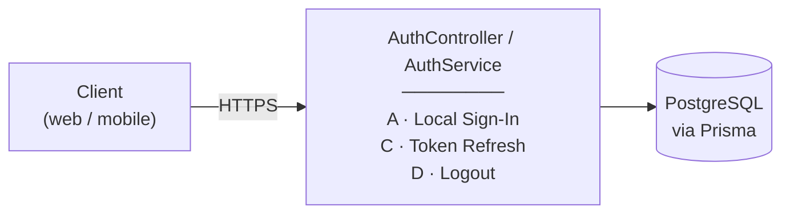
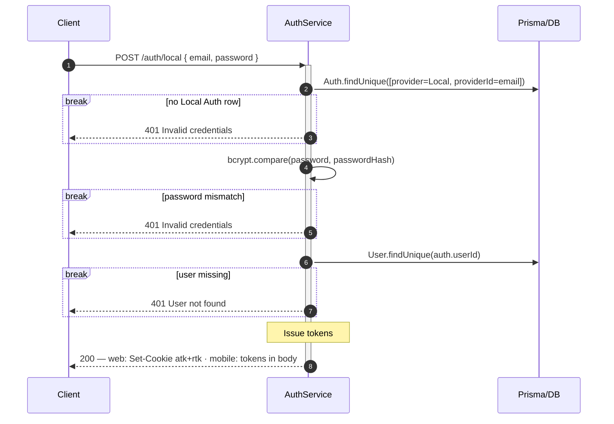
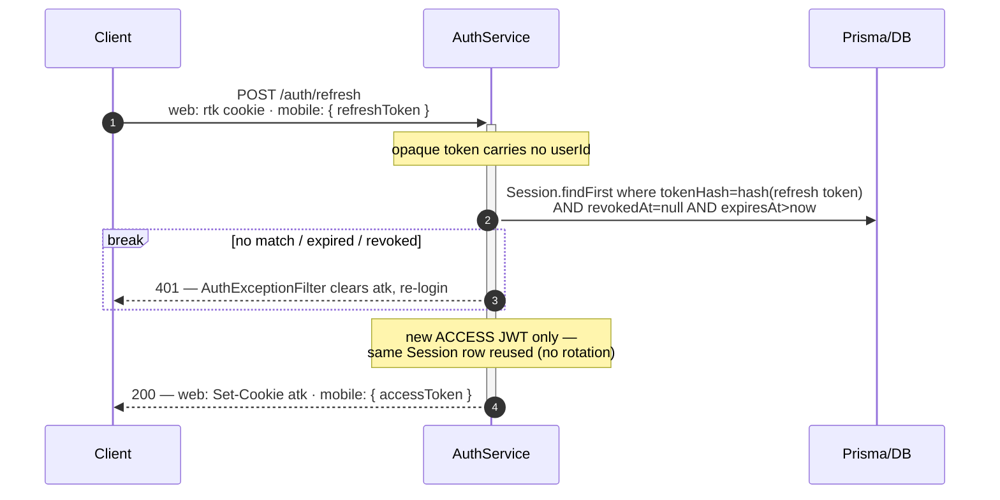
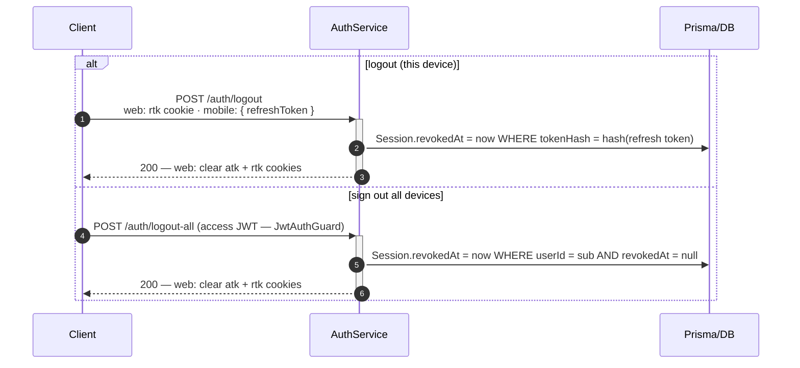

# Authentication Flows — VinaUp API

This document describes every authentication **flow** — sign-in, token issuance, and logout. The
data model behind these flows (`User` / `Auth` / `Session`) lives in the Prisma schema
([schema.prisma](../../src/prisma/schema.prisma)) — read it first.

> **Where the client keeps each token.** The platform is told apart by a request header
> (`x-request-platform`):
> - **Web** — both the access and refresh tokens are set by the server as **`httpOnly` cookies**
>   (`Secure` + `SameSite=strict` in prod); the response body carries no token. `httpOnly` means
>   page JavaScript cannot read either token, so an XSS cannot exfiltrate them — the trade-off is
>   CSRF exposure, neutralised by `SameSite=strict`.
> - **Mobile** — there is no cookie jar, so the server returns the tokens in the **response body**;
>   the app stores them and resends the access token via `Authorization: Bearer`.

---

## System overview

Every auth request — no matter which flow — travels the **same pipeline**. What differs per
flow is only the **route** it hits and the logic inside `AuthService`. The node below lists
each route next to the flow (A · C · D) that documents it, so you can see where every flow sits
before reading the detailed diagrams.



---

## Token model

| Token | Shape | Lifetime | Stored server-side | Carried client → server |
| ----- | ---- | -------- | ------------------ | ----------------------- |
| **Access** | Stateless, self-contained JWT — `{ sub: userId }`, signed with **`JWT_SECRET`** | 1 hour | nothing (stateless) | `httpOnly` + `Secure` + `SameSite` cookie (web) · `Authorization: Bearer` header (mobile) |
| **Refresh** | Opaque, high-entropy random | 7 days | `Session.tokenHash` — **SHA-256** hash (raw value never stored) | `httpOnly` + `Secure` + `SameSite` cookie (web) · response body (mobile) |

**Reused named steps** (the `Note over` boxes in the flow diagrams below):

- **Issue tokens** — sign the access JWT and insert a `Session` holding the refresh-token hash, then deliver both per platform: **web** receives them as `httpOnly` cookies (`Set-Cookie`); **mobile** receives them in the response body.

---

## Token shape — JWT vs Opaque (Reference)

### 1. Mental model — two ways to answer "is this token valid?"

There are exactly two strategies, and they are opposites:

```
Self-verifying token (JWT)        Reference token (opaque)
─────────────────────────         ────────────────────────
token CARRIES its own proof       token is a meaningless handle
validity = signature recomputes   validity = a matching row exists
  → NO need database hit                 → REQUIRES a database lookup
stateless                         stateful
```

- **Self-verifying token = JWT.** The token *contains* its claims (`{ sub }`) plus a signature
  `HMAC-SHA256(header.payload, secret)`. The server proves it by **recomputing the signature**.
- **Reference token = Opaque.** The token is high-entropy random bytes carrying **no payload**. Its
  only job is to *point at* server-side state (or DB record). Validity means "a live row hashes
  to this value" — which is a **DB lookup**.

### 2. The rule

> **Use a JWT when verification must be stateless AND the token is short-lived AND pre-expiry
> revocation is NOT required. Otherwise use a reference (opaque) token.**

Read it as a gate: the moment a token must be **revocable**, **looked up**, or **long-lived**, its
validity already depends on server state. Reach for the opaque token.

| | Lifetime | Revoke before expiry? | DB on every check? | ⇒ Shape |
| --- | --- | --- | --- | --- |
| **Access** | 1 hour | no (stateless) | no | **JWT** |
| **Refresh** | 7 days | **yes** (once consumed) | **yes** (revocation check) | **opaque** |

### 3. Anti-pattern — "sign a JWT, then hash it for storage"

A natural instinct is to make the refresh token a JWT too, then store `SHA-256(jwt)`.
**Should be avoided**, for three compounding reasons:

1. **Both JWT powers are thrown away.** We hash the JWT into an opaque blob and we **never verify its
   signature**; the payload only duplicates the columns the DB schema.
2. **It weakens the security argument.** A JWT's content is largely *predictable* (fixed, guessable header).

→ The opaque token is the **minimal correct primitive**: random secret out to the client, its SHA-256
hash kept server-side for lookup.

> **Why SHA-256 here, but bcrypt for passwords.** A reference token is hashed only to survive a DB leak
> and to allow lookup-by-hash (deterministic, no salt). Fast unsalted SHA-256 is correct *because* the
> input already has 256 bits of entropy. Passwords are the opposite (low entropy), so they need bcrypt's slow, salted hashing. Hash strength must match input entropy, not be maximised blindly.

---

## Flow A — Local Sign-In (email + password)

The trunk flow. Email + password → session.



> The sign-in response also carries the user's `organizations` and their owned/linked counts —
> a convenience so the client can render its workspace switcher without a second round-trip.

---

## Flow C — Token Refresh

Silent renewal: trade the refresh token for a fresh access token. No rotation.



> **No rotation** means the same refresh token is reused for 7 days. Acceptable here because the
> client is confidential (our own first-party web/mobile over HTTPS, cookie is `httpOnly`), per
> RFC 9700 §4.14. Compromise is bounded by the 7-day `expiresAt` and the manual revoke (Flow D).

---

## Flow D — Logout / Sign-Out-All

Server-side revocation by stamping `Session.revokedAt`. A revoked session fails Flow C
immediately; the access token is left to expire on its own (stateless by design).



> **Idempotent.** Logout never errors on a stale or missing refresh token — it still clears the
> web cookies and returns `200`, so "log out when already logged out" is a no-op.

> Access tokens already minted stay valid until their expiry — the deliberate trade-off of
> stateless JWTs. Shorten the access TTL if tighter revocation is ever required.
