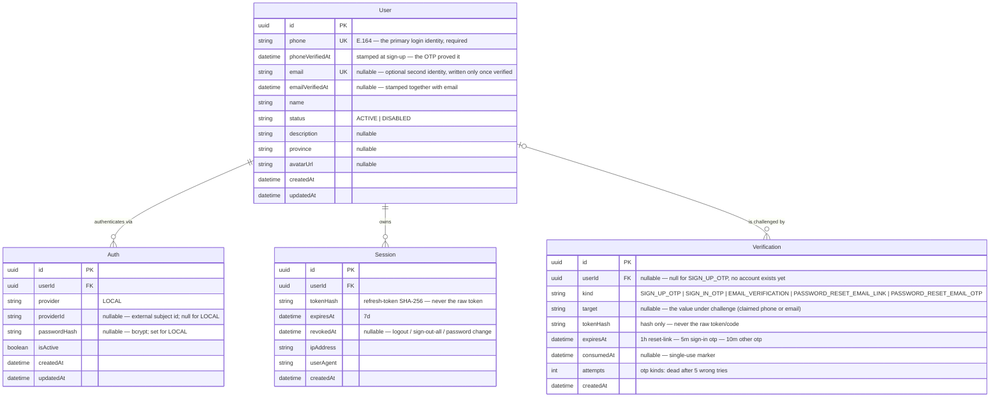

# Database Diagram — VinaUp API

**Database:** PostgreSQL — **ORM:** Prisma 7 (`prisma-client` generator), source of truth in
[schema.prisma](../../src/prisma/schema.prisma).

This file covers the **Identity & Access** domain only — the four tables every authentication flow
touches. The operational domains attach to it by `userId` foreign key and need no change to the tables
below.

> This is the **structural** view (entities + constraints). For the **behavioral** view — how these
> entities move through sign-up / sign-in / refresh / logout / reset / email linking — see the
> [auth flows](./authen/).

> **On the `string` columns labelled `"A | B | …"`** (`status`, `provider`, `kind`): these are plain
> `String` columns, **not** native Postgres enums. The allowed set is declared once as an `as const`
> object read by Zod for input — see [CODING-CONVENTION §1.3](../CODING-CONVENTION.md#13-enum-constants).

---

## Domain — Identity & Access



### Entity reference

| Entity | Key constraints | Indexes |
| ------ | --------------- | ------- |
| **User** | `@@unique(phone)`; `@@unique(email)` (nullable) | PK `id` |
| **Auth** | FK `userId` (cascade); `@@unique([userId, provider])`; `@@unique([provider, providerId])` | via the composite uniques |
| **Session** | FK `userId`; hashes only | `@@index([userId])` |
| **Verification** | FK `userId` **nullable**; hashes only; single-use via `consumedAt` | `@@index([userId, kind])`, `@@index([kind, target])` |

| Entity | Description |
| ------ | ----------- |
| **User** | A person's identity. `phone` is the anchor — required, unique, and **proven by OTP before the row exists** ([Sign-Up](./authen/SIGN-UP.md)). `email` is an **optional second identity** attached later and written only once proven ([Link Email](./authen/LINK-EMAIL.md)). `status = DISABLED` blocks sign-in while retaining everything the user created. |
| **Auth** | A credential — one row per login method. Today exactly one exists (`LOCAL` = our own password), so every user has one row carrying a bcrypt `passwordHash`. |
| **Session** | A signed-in device, holding the hashed **refresh token** only. Carries `ipAddress` / `userAgent`, soft-revoked on logout, sign-out-all, and every password change or reset. |
| **Verification** | A **one-time** challenge — a sign-up code, a sign-in code, an email-verification code, or a password-reset link/code. Short-lived, single-use (`consumedAt`), attempt-capped, hash-only. |

---

## Auth model

**Identity vs credential.** `User` answers *who you are*; `Auth` answers *how you prove it*. Separate
tables so one identity can own several proof methods as separate rows — adding a provider becomes a new
row, not a migration.

```
User(id=u1, phone=+84912345678, email=linh@vinaup.com)
 └─ Auth(provider=LOCAL, providerId=null, passwordHash=…)   ← phone/email + password
```

### `provider` names the authority, not the field you typed

| | Vouched by | Where it lives |
| --- | --- | --- |
| Phone + password | **us** | `User.phone` + one `Auth(LOCAL)` row |
| Email + password | **us** | `User.email` + the **same** `Auth(LOCAL)` row |
| Google (future) | Google | its own `Auth(GOOGLE, providerId=<sub>)` row |

Phone and email are two identity columns **we** vouch for, so either one resolves to the same `User` and
the same single password.
### The two unique constraints on `Auth`

| Constraint | Rule in words | Bug it prevents |
| ---------- | ------------- | --------------- |
| `@@unique([userId, provider])` | a user has **at most one credential per provider** | one user ending up with two `LOCAL` passwords |
| `@@unique([provider, providerId])` | **one external account maps to exactly one user** | two users both claiming the same Google account |

`providerId` is `null` for `LOCAL`, and Postgres treats each `NULL` as distinct — so the second
constraint imposes nothing today and only binds when an external provider lands.

### `email` is nullable-unique

Same Postgres rule: a unique index permits **many** `NULL`s, so unlimited phone-only accounts coexist
while any address that *is* present belongs to exactly one user.

Because the column is written only by the link-email flow at consume time, **a non-null `User.email` is
verified by construction** — sign-in and password reset trust it without reading `emailVerifiedAt`,
which records *when*, not *whether*.

### Why `Verification` carries `target`, and why `userId` is nullable

A challenge is *about* something, and that something is not always the account:

| `kind` | `userId` | `target` | Found by |
| ------ | -------- | -------- | -------- |
| `SIGN_UP_OTP` | **`null`** | the phone being registered | `target` |
| `SIGN_IN_OTP` | the account | `null` | `userId` |
| `EMAIL_VERIFICATION` | the account | the email being claimed | `userId` |
| `PASSWORD_RESET_EMAIL_LINK` | the account | `null` | `tokenHash` |
| `PASSWORD_RESET_EMAIL_OTP` | the account | `null` | `userId` |

`target` holds a value the account **does not own yet**, for exactly as long as the challenge lives.
Writing it to `User` early would occupy the unique index, letting anyone permanently block a stranger's
phone or email by typing it — so it waits on the challenge row and dies with it.

`userId` is nullable for the one kind where **no account exists**: a sign-up code is issued before there
is anything to attach it to, and creating a placeholder `User` first would reintroduce exactly the
squatting problem `target` avoids ([Sign-Up](./authen/SIGN-UP.md)). Every other kind fills it.

### Session vs Verification

Both hold a hashed, expiring token, but their lifecycles differ — so they are split rather than sharing
one table with a `kind` discriminator:

| | `Session` (refresh) | `Verification` (one-time) |
| --- | --- | --- |
| Nature | a signed-in **device** | a **one-time** challenge |
| Reuse | on every token refresh | redeemed **once**, then dead |
| Lifetime | 7 days | 1h (reset link) — 10m / 5m (otp) |
| End of life | `revokedAt` (soft revoke) | `consumedAt` (single use) |
| `ipAddress` / `userAgent` | meaningful | irrelevant |
| `attempts` / `target` | n/a | the guard, and the value under challenge |

Splitting keeps each table cohesive — no sparse columns on reset rows, no "remember to filter `kind`"
footgun. Auth.js separates `Session` from a one-time `VerificationToken` for the same reason.

---

## Hashing policy

| Value | Hash | Why |
| ----- | ---- | --- |
| Password | **bcrypt**, cost 10, salted | low-entropy human input — the hash must be *slow*, and salted so identical passwords do not collide |
| Refresh / reset-link token | **SHA-256**, unsalted | 256 bits of entropy already; hashed only to survive a DB leak, unsalted **because** lookup happens by hash |
| 6-digit codes | **SHA-256**, unsalted | brute force is stopped by the 5-attempt cap and the TTL, not by hash cost; the hash keeps a DB leak from handing over live codes |

Hash strength matches input entropy; it is not maximised blindly.

---

## Out of scope

| Not modeled | Would attach as |
| ----------- | --------------- |
| Google sign-in | `Auth(provider=GOOGLE, providerId=<sub>)` — a new row, no schema change |
| Two-factor authentication | `User.twoFaMethod` + `User.totpSecret` + a `Verification` kind |
| Password reset over the phone channel | a `PASSWORD_RESET_SMS_OTP` kind — no schema change, [weighed here](./authen/LOCAL-SIGN-IN.md#mode-2--otp) |
| Account deletion | `USER_STATUS.DELETED` + PII tombstoning to release the unique keys |
| Changing phone or email | a `Verification` row with `target` set to the new value |
