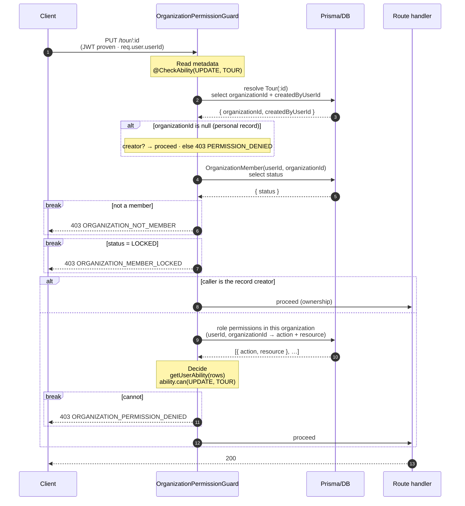
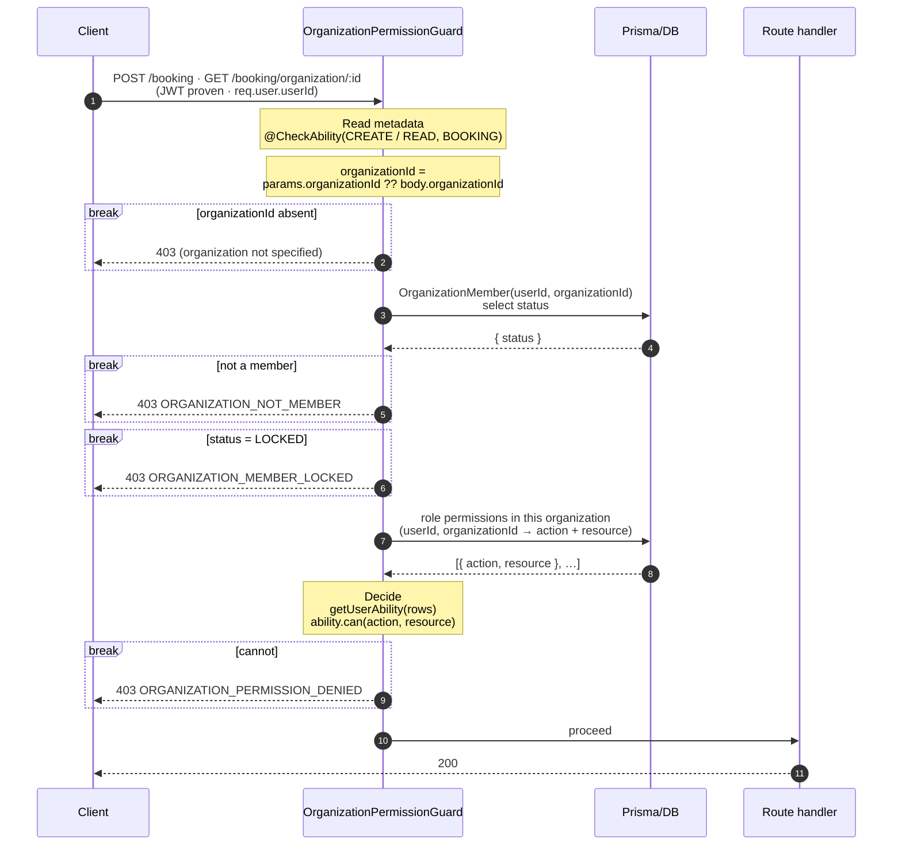
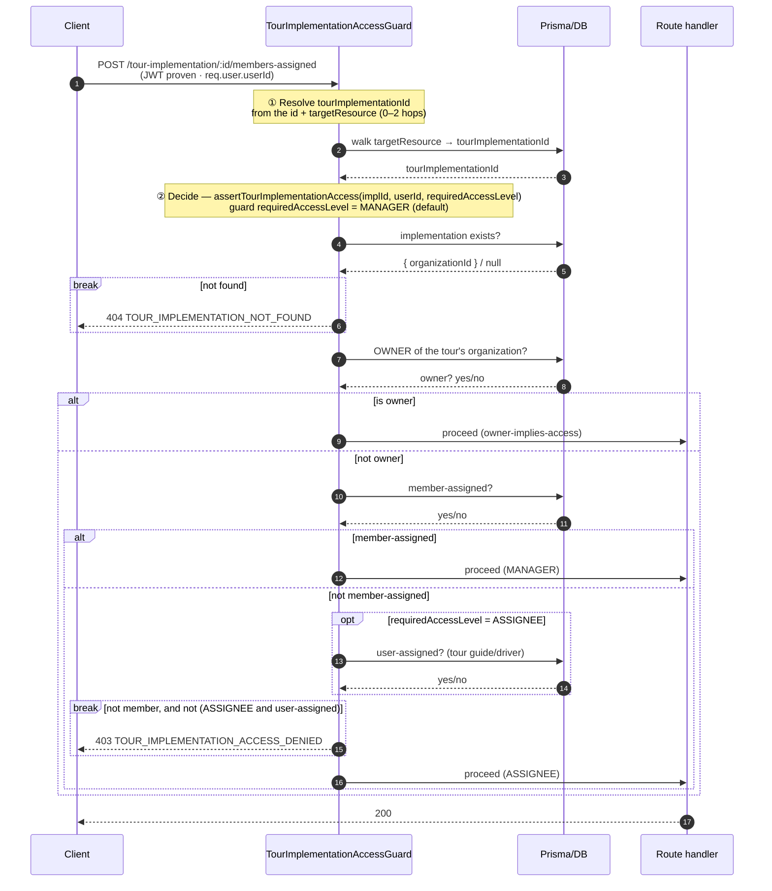
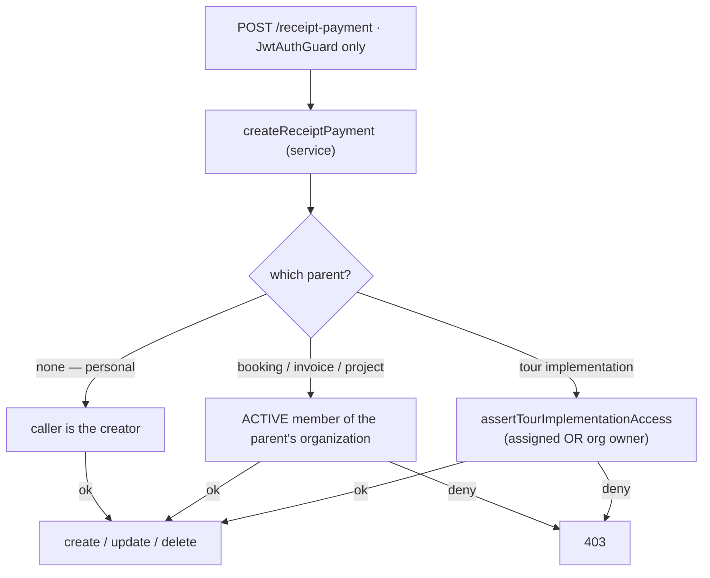

# RBAC & ReBAC Enforcement Flow

What one request goes through at runtime. The models, data and engines behind it are in
[RBAC-ReBAC-PATTERN](../pattern/RBAC-ReBAC-PATTERN.md); this doc is only the walk-through.

A request takes **one** of three flows, decided by the route's plane
([RBAC-ReBAC-PATTERN](../pattern/RBAC-ReBAC-PATTERN.md) §6):

| The route acts on…                                            | Flow                                       |
| ------------------------------------------------------------- | ------------------------------------------ |
| an organization's documents (`Booking`, `Invoice`, `Tour`, …) | **Flow 1** — `OrganizationPermissionGuard` |
| a tour's execution (crew assignments)                         | **Flow 2** — `TourImplementationAccessGuard`             |
| a `ReceiptPayment` mutation (plane depends on the parent)     | **Flow 3** — service-selected              |

> **Preconditions (all flows).** `JwtAuthGuard` has already proven the access JWT →
> `req.user.userId`. There is **no** ambient organization: whatever scope a flow needs (the owning
> organization, or the tour) it resolves itself. Every flow starts from a proven user and derives the
> rest.

---

## Flow 1 — Organization RBAC guard

`OrganizationPermissionGuard` reads the route's `@CheckAbility(action, resource)` cell, then branches on one thing: **does the route have an `:id`?**

| | **1a — route has `:id`** | **1b — route has no `:id`** |
| --- | --- | --- |
| e.g. | `PUT /tour/:id`, `DELETE /invoice/:id` | `POST /booking`, `GET /booking/organization/:id` |
| Organization from | the record itself, loaded by record id | the request: `params.organizationId ?? body.organizationId` (absent → 403) |

### Flow 1a — acting on an existing record (`:id`)

```ts
@UseGuards(JwtAuthGuard, OrganizationPermissionGuard)
@CheckAbility(PERMISSION_ACTION.UPDATE, PERMISSION_RESOURCE.TOUR)
@Put(':id')
```

- **Resolve the record** — load the target by id.
- **Personal short-circuit** — some resources (`Invoice`, `Project`) can be personal, with no owning
  organization. When `organizationId` is null there is no matrix to consult: only the creator may act.
- **Check membership** — the caller must be an `ACTIVE` member of that organization, not `LOCKED`.
- **Ownership short-circuit** — if the caller created the record, they may always act on it; the
  guard returns without consulting the matrix.
- **Decide** — load the caller's role permissions in this organization fresh from the DB,
  `getUserAbility(rows)` → `ability.can(action, resource)`.



### Flow 1b — acting on a collection, or creating (no `:id`)

```ts
@UseGuards(JwtAuthGuard, OrganizationPermissionGuard)
@CheckAbility(PERMISSION_ACTION.READ, PERMISSION_RESOURCE.BOOKING)
@Get('/organization/:organizationId')   // a collection scoped to an organization

@UseGuards(JwtAuthGuard, OrganizationPermissionGuard)
@CheckAbility(PERMISSION_ACTION.CREATE, PERMISSION_RESOURCE.BOOKING)
@Post('/')                              // create — organization named in the body
```

- **Resolve the organization** — no record to load, so read it straight from the request:
  `params.organizationId ?? body.organizationId`. Absent → `403` (organization not specified).
- **Check membership** — the caller must be an `ACTIVE` member of that organization, not `LOCKED`.
- **Decide** — `getUserAbility(rows)` → `ability.can(action, resource)`; refusal throws
  `OrganizationPermissionDeniedException`.



---

## Flow 2 — Tour implementation access guard

Example route (managing a tour's crew):

```ts
@UseGuards(JwtAuthGuard, TourImplementationAccessGuard)
@CheckTourImplementationAccess({ source: 'param', idKey: 'id', targetResource: TOUR_TARGET_RESOURCE.TOUR_IMPLEMENTATION })
@Post(':id/members-assigned')
```

The plane splits cleanly into **two stages**, driven by two independent knobs a route sets on
`@CheckTourImplementationAccess`:

- **① Resolve** — walk from the route's id to the owning `tourImplementationId`. The `targetResource`
  says which model the id is, and therefore how many hops the walk takes (`readTargetId` reads the id,
  `resolveTourImplementationId` walks it):

  | `targetResource` | the id points to | hops |
  | --- | --- | --- |
  | `TOUR_IMPLEMENTATION` | the implementation itself | 0 |
  | `TOUR` | a `Tour` (1:1 with its implementation) | 1 |
  | `TOUR_IMPLEMENTATION_ASSIGNMENT` | an assignment | 1 |
  | `USER_ASSIGNED_TOUR_IMPLEMENTATION` | a user-assignment | 2 |

- **② Decide** — `assertTourImplementationAccess(tourImplementationId, userId, { requiredAccessLevel })`,
  the single ReBAC engine. `requiredAccessLevel` is the bar the **route** demands — not the caller's level;
  the engine derives what the caller *holds* (owner / member-assigned / user-assigned rows) from the DB and
  checks it clears the bar. `MANAGER` (the default — crew management, cleared by the org `OWNER` or a
  **member-assigned** user) or `ASSIGNEE` (also admits a non-member **user-assigned** tour guide/driver).




---

## Flow 3 — Receipt payment (service-selected plane)

A `ReceiptPayment` mutation route carries **only** `JwtAuthGuard` — no authorization guard — because
which plane governs it depends on the parent the receipt payment attaches to, a fact known only once
the service reads it ([RBAC-ReBAC-PATTERN](../pattern/RBAC-ReBAC-PATTERN.md) §7.4). The service makes the choice:



The same three planes as everywhere else — tour implementation access, organization RBAC, ownership — only the
_selection_ is deferred to the service. This is the single place a route's plane is not fixed by its
guards.

---

## Deliberate decisions

- **Permissions are read from the DB on every guarded request** — never embedded in the access
  JWT. Cost: a couple of indexed queries per request. Bought: a matrix edit by the organization
  owner, or a crew change by a director, takes effect on the _next request_, not up to a token
  lifetime later when the JWT rotates. Staleness on an authorization decision is the wrong trade.
- **Denial names the reason.** RBAC refusals are one of three HTTP 403 codes —
  `ORGANIZATION_NOT_MEMBER`, `ORGANIZATION_MEMBER_LOCKED`, `ORGANIZATION_PERMISSION_DENIED`;
  tour-implementation-access refusals carry their own 403
  ([ERROR-CODE-REFERENCE](../reference/ERROR-CODE-REFERENCE.md)). Separating them keeps "you are not
  in this organization" distinct from "your role lacks this cell" distinct from "you are not on this
  tour" — and the client owns the Vietnamese copy for each, keyed by code.
- **One plane per route.** A route's guards fix its plane (Flow 1 or Flow 2); the sole exception is
  the receipt-payment mutation, whose plane the service selects (Flow 3). No route runs two
  authorization guards.
