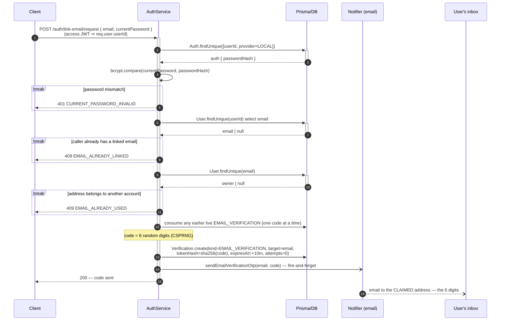
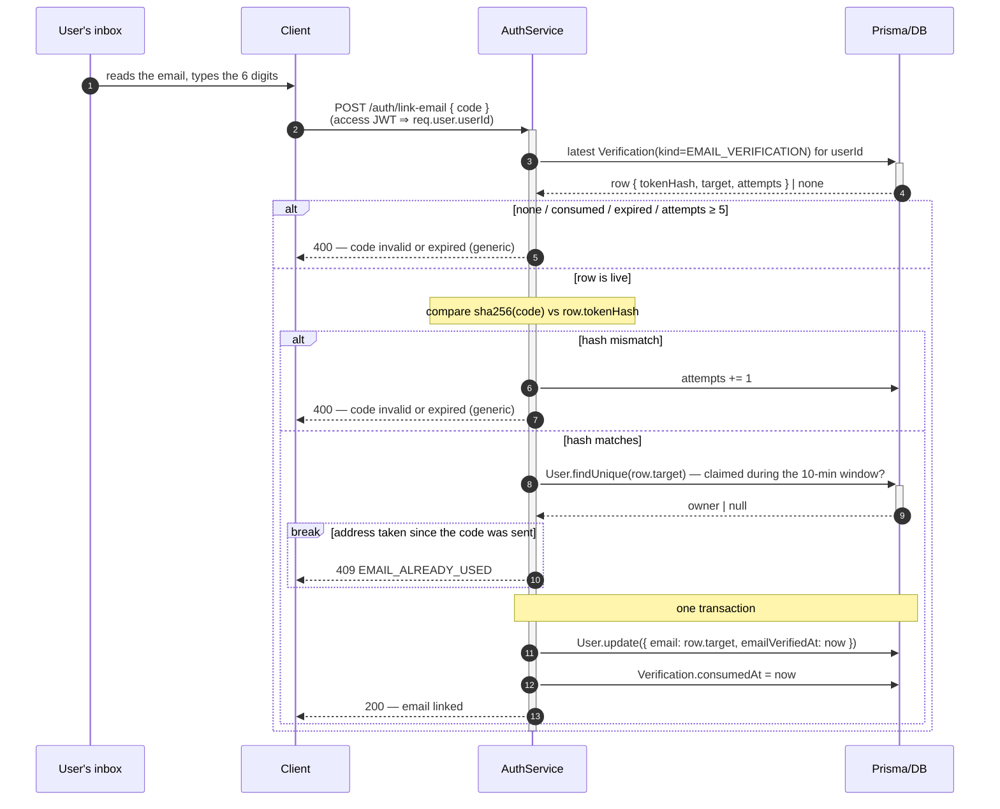

# Link Email

Attach an email to an existing account: two half-flows around one
`Verification(kind=EMAIL_VERIFICATION)`, driven by a 6-digit code mailed to the address being claimed.
Authorized by the access JWT **and** by the caller's current password.

An email is never collected at [sign-up](./SIGN-UP.md). Linking one buys a second `identifier`
at [sign-in](./LOCAL-SIGN-IN.md) and the only channel the password-reset flows use.

**Step 1 — Request** (`POST /auth/link-email/request`): prove the password, claim the address, send a code.

**Step 2 — Link** (`POST /auth/link-email`): the code alone; the address comes off the row.

> **Why the current password on top of the JWT.** The JWT proves a session exists, not that the human is
> present. Without the step-up, a stolen session attaches the attacker's address, and from there
> [forgot-password](./PASSWORD-RESET-EMAIL-LINK.md) turns a 7-day token into permanent ownership of the
> account. Re-entering the password is the one check a session thief cannot pass.

> **The address is not written until the code is consumed.** An unverified address on `User.email` would
> occupy the unique index, letting anyone permanently block a stranger's address by typing it into their
> own account. Held on the challenge row, the claim expires by itself in 10 minutes —
> [why `target` exists](../DB-DIAGRAM.md#why-verification-carries-target-and-why-userid-is-nullable).

> **Uniform failure on verify, named conflicts on request.** Verify collapses no-row / expired / consumed
> / cap-reached / wrong-code into one `400`, so no response tells an attacker the row is spent and a
> fresh one should be triggered.

> **Changing or removing a linked email is a separate flow, not built.** `email` and `phone` are absent
> from the profile-update schema on purpose, and `EMAIL_ALREADY_LINKED` makes re-running this flow a
> `409` rather than a silent overwrite.

> **The code leaves through the notifier**, which resolves `MAIL_DRIVER` at boot. If `MAIL_DRIVER=log`,
> the code is written into the application log so the flow runs end to end without a mail provider →
> [Notifier Facade Pattern](../../pattern/NOTIFIER-FACADE-PATTERN.md#the-log-drivers).
