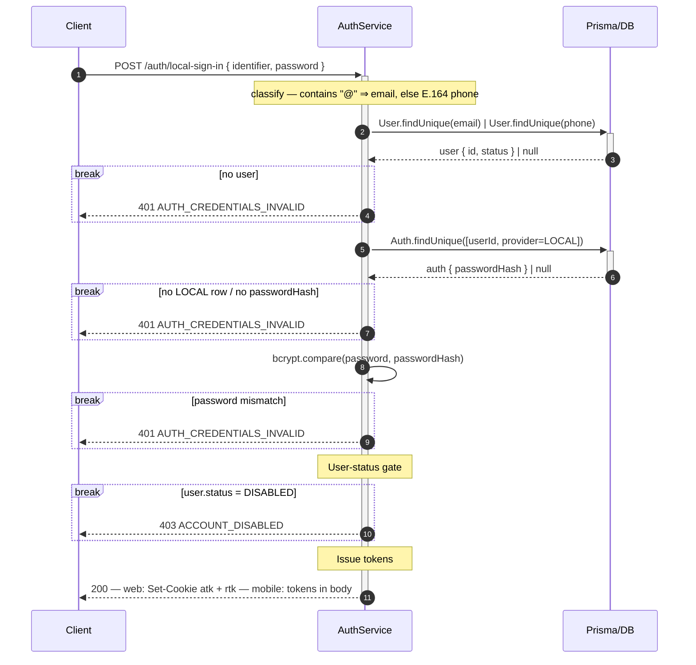
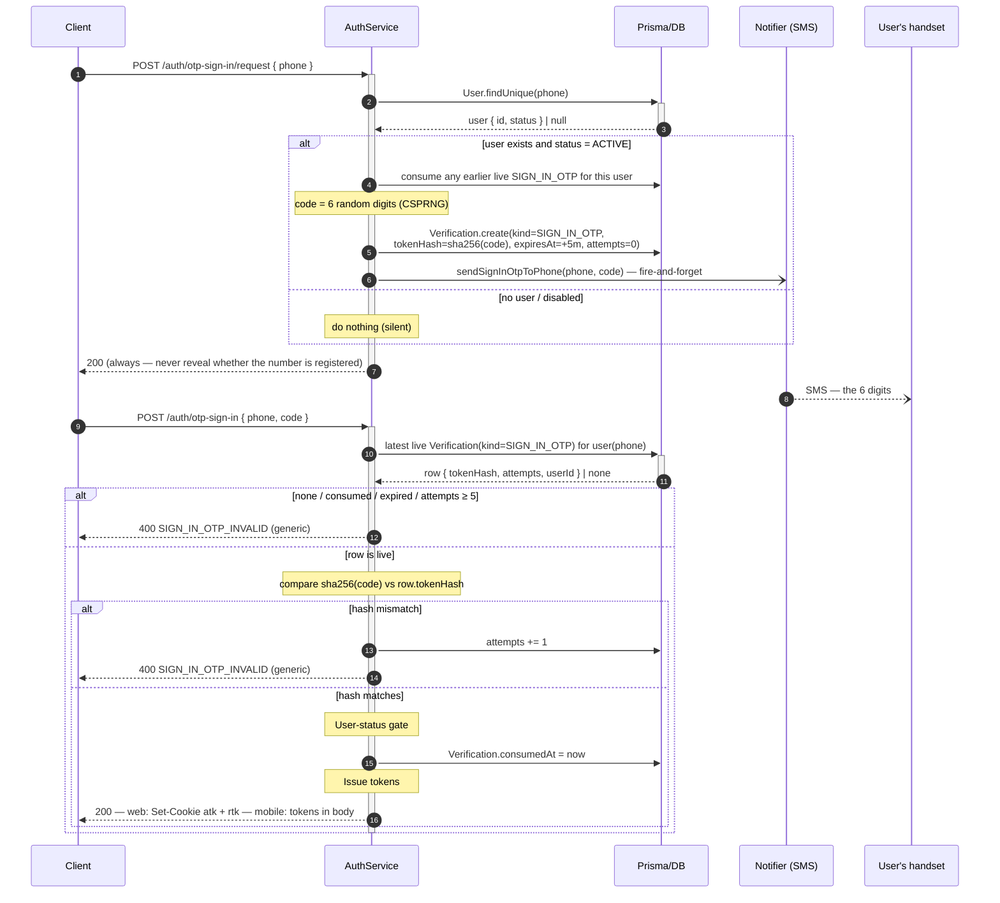

# Local Sign-In

Two ways in, both vouched for by us (hence _local_ — no federated provider is involved), both ending in
the same two named steps that every other flow refers back to:

| Mode         | Route(s)                                                    | Proves you by                                              |
| ------------ | ----------------------------------------------------------- | ---------------------------------------------------------- |
| **Password** | `POST /auth/local-sign-in`                                  | something you **know** — the password behind `Auth(LOCAL)` |
| **OTP**      | `POST /auth/otp-sign-in/request` → `POST /auth/otp-sign-in` | something you **have** — the SIM behind `User.phone`       |

The two named steps:

- **User-status gate** — reject `user.status = DISABLED` with `403`. In password mode it runs **after**
  the password check: telling an anonymous caller that an account is disabled would confirm it exists.
- **Issue tokens** — sign the access JWT (`{ sub: userId }`, 15-min) and insert a `Session` holding the
  **SHA-256** hash of a fresh opaque refresh token (7-day) plus `ipAddress` / `userAgent`.

---

## Mode 1 — Password

One `identifier` field takes either the phone or the linked email, both resolve to the same `User` and
the same single `Auth(LOCAL)` credential.

> **One field, classified by `@`.** An `@` cannot appear in a phone number nor be absent from an email,
> so the split is total and costs one lookup. A phone goes through the same `normalizeVnPhone` transform
> as [sign-up](./SIGN-UP.md) — the string typed must match the string stored.

---

## Mode 2 — OTP

No password at all: prove possession of the number.

> **The request step is always `200`, unlike sign-up's `409`.** A phone number is trivially enumerable,
> and here — unlike a registration form — nothing about the product requires answering "is this number
> registered".

> **No `Auth` row is involved.** An OTP is a second _proof_ of an identity we already vouch for, not a
> second credential provider, so nothing is written to `Auth`.
> [why that distinction holds](../DB-DIAGRAM.md#provider-names-the-authority-not-the-field-you-typed).

> **The code leaves through the notifier**, which resolves `PHONE_DRIVER` at boot.
> If `PHONE_DRIVER=log`, the code is written into the application log so the flow runs end to end without a provider account →
> [Notifier Facade Pattern](../../pattern/NOTIFIER-FACADE-PATTERN.md#the-log-drivers).

---

## Issue tokens — what gets minted

| Token       | Shape                                                     | Lifetime | Stored server-side            | Carried client → server                               |
| ----------- | --------------------------------------------------------- | -------- | ----------------------------- | ----------------------------------------------------- |
| **Access**  | stateless JWT `{ sub: userId }`, signed with `JWT_SECRET` | 15 min   | nothing                       | `atk` cookie (web) — `Authorization: Bearer` (mobile) |
| **Refresh** | opaque, 32 random bytes hex                               | 7 days   | `Session.tokenHash` — SHA-256 | `rtk` cookie (web) — response body (mobile)           |

_Why_ the refresh token is opaque rather than a JWT is argued in
[Token Refresh](./TOKEN-REFRESH.md).

> **Token delivery per platform**, switched on the `x-request-platform: mobile` header
> (`isMobileRequest`). **Web** — both tokens as `httpOnly` + `Secure` + `SameSite` cookies, nothing in
> the body; page JavaScript cannot read them, so an XSS cannot exfiltrate them, and `SameSite=strict`
> closes the CSRF that trade opens. **Mobile** — no cookie jar, so both come back in the body. The `rtk`
> cookie is path-scoped to `/auth` (not `/auth/refresh`) because [logout needs it too](./LOGOUT.md).

> **The `atk` cookie's `maxAge` equals the JWT's `exp` — 15 minutes.** A cookie outliving its token makes
> "am I signed in?" have two answers that disagree.

> **The response carries the user only.** `AuthService` does not read the organization tables: the client
> already fetches that list on a cold start signed in with a stored token, so bundling it here would
> duplicate a path that must exist anyway.
