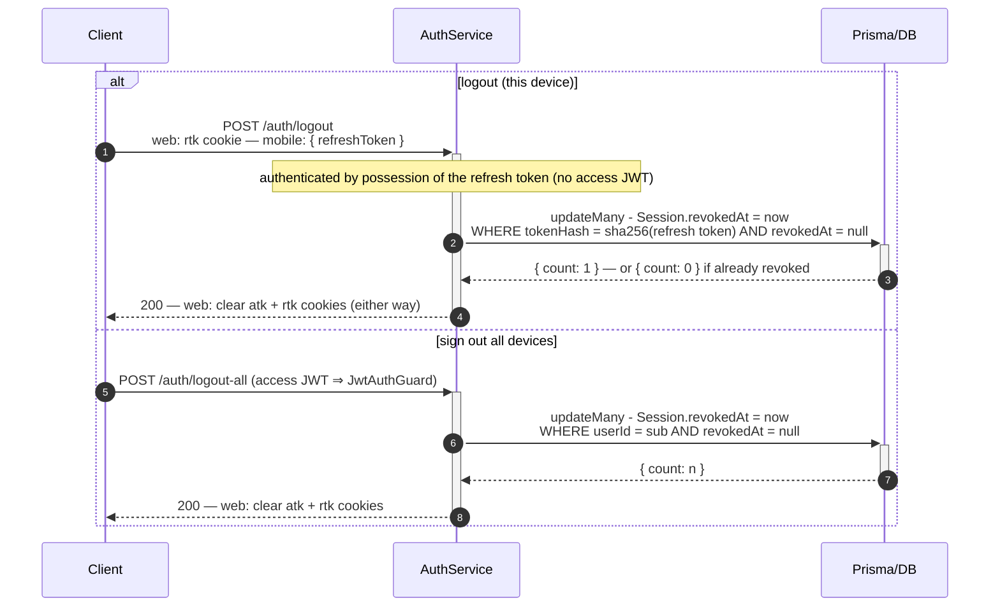

# Logout / Sign-Out-All

Server-side revocation by stamping `Session.revokedAt`. A revoked session fails the next
[token refresh](./TOKEN-REFRESH.md) immediately; the 15-min access token is left to expire on
its own (stateless by design).

> **`/auth/logout` deliberately has no `JwtAuthGuard`.** Logging out must still work once the access
> token has expired — which is exactly when a user reaches for it.

> **Idempotent logout.** `updateMany` means a missing or already-revoked token revokes 0 rows without
> throwing — cookies are cleared and `200` returned regardless. This is also why the refresh cookie is
> **path-scoped to `/auth`**, not `/auth/refresh`: the browser must ship `rtk` here too.

> **Why `updateMany`, not `update`.** `update` accepts only a unique field in `where`, and `tokenHash` is
> a plain column; forcing it would cost a `findFirst` then an `update` — two round-trips. "Many" is not a
> risk: the hash is SHA-256 of a 256-bit random token, so it matches exactly one row.

> Access tokens already minted stay valid until their 15-min expiry — the deliberate trade-off of
> stateless JWTs. Shorten the TTL if tighter revocation is ever required.
