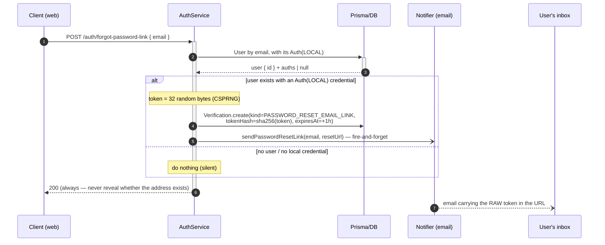
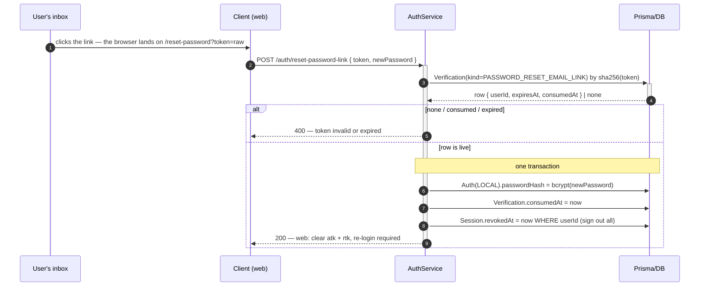

# Password Reset — Email Link

Two half-flows around a single one-time `Verification(kind=PASSWORD_RESET_EMAIL_LINK)`, driven by an
**opaque link token** emailed as `?token=`. This is the **web** format. The **mobile** format delivers a
typed code over the same channel — see
[Password Reset — Email OTP](./PASSWORD-RESET-EMAIL-OTP.md).

> **`EMAIL` names the channel, `LINK` names the format.** The platform picks the format; the channel is
> email for both reset flows and is the axis that may branch later.

> An account that never [linked an address](./LINK-EMAIL.md) does not use this flow at all — it gets back
> in through [OTP sign-in](./LOCAL-SIGN-IN.md#mode-2--otp), which needs no password. Setting a **new**
> password without an email address is not built.

> **Why the reset token is opaque.** It must be **revocable** (single-use consume) and is **looked up**
> by hash on confirm, so validity depends on server state → a reference (opaque) token, not a JWT. The
> raw value is high-entropy random; only its **SHA-256** hash is stored, and the reset URL is the only
> place the raw value ever appears.

**Half-flow 1 — Forgot step** (`forgot-password-link`): always returns `200`, so the response never
reveals whether the address exists.

**Half-flow 2 — Reset step** (`reset-password-link`): the token is globally unique, so the row is fetched
by `sha256(token)` directly — the lookup itself *is* the match.

> **Anti-timing-leak.** The send is fire-and-forget, not awaited: awaiting the round-trip would
> make the response measurably slower when the address exists, leaking existence via timing and
> defeating the always-`200` above. The
> [facade's methods return `void`](../../pattern/NOTIFIER-PATTERN.md#question-2-in-the-method-body--which-contract-does-a-facade-method-use),
> so there is no promise to await.

> **Local-credential accounts only.** A link is issued only when the user has an `Auth(LOCAL)` row with a
> `passwordHash`. The miss is silent (still `200`), and it guarantees the confirm step always finds the
> row it updates.

> **Revoke every session.** Rotate the credential, consume the token, revoke the sessions — three writes,
> one transaction.

> **The reset URL** is `${WEB_APP_URL}/reset-password?token=raw`, read through the typed `auth` config
> namespace, never `process.env` inline.
