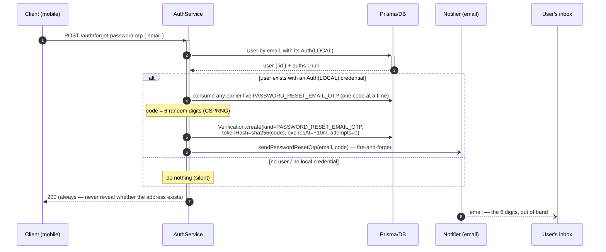
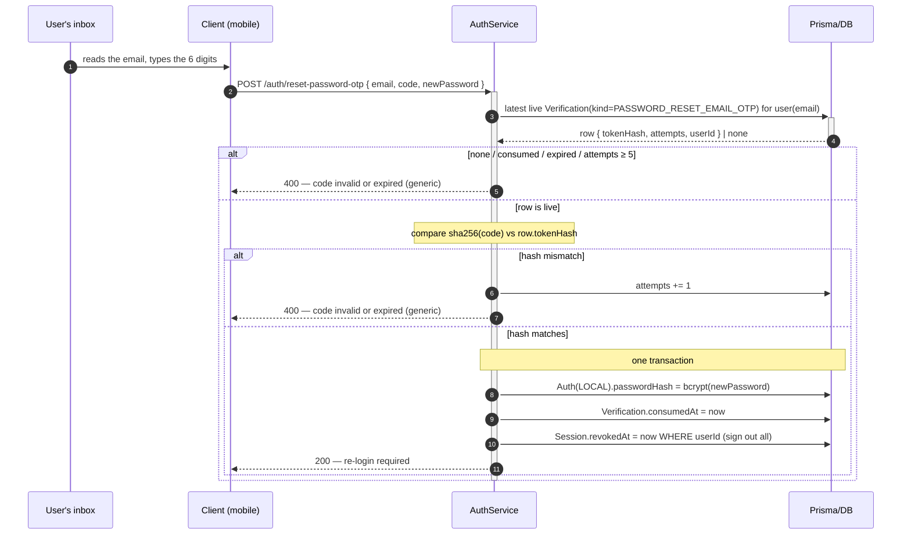

# Password Reset — Email OTP

Two half-flows around a one-time `Verification(kind=PASSWORD_RESET_EMAIL_OTP)`, driven by a **typed
6-digit code mailed to the account's email**. This is the **mobile** format — fully in-app, no browser
hop, no deep link. The web format mails an opaque link token over the same channel — see
[Password Reset — Email Link](./PASSWORD-RESET-EMAIL-LINK.md).

> **Channel and format are two different axes, and only one of them varies.** Both reset flows deliver
> over **email**. The platform picks the *format* (a clickable link on web, a typed code on mobile).
> `EMAIL` is in the name and in the `kind` because the channel is the axis that *may* branch — a
> `PASSWORD_RESET_SMS_OTP` would carry the same code over the phone channel instead.

> An account that never [linked an address](./LINK-EMAIL.md) does not use this flow at all — it gets back
> in through [OTP sign-in](./LOCAL-SIGN-IN.md#mode-2--otp), which needs no password. Setting a **new**
> password without an email address is not built.

## Why a code, not the web's link token

Same channel, two formats — and they are **different `Verification.kind` values on purpose**, because
their validation rules genuinely differ:

| | **Link token** (web) | **OTP code** (mobile) |
| -------------------------- | --------------------- | ---------------------------------------- |
| Entropy | high (256-bit random) | low (6 digits ≈ 20 bits) |
| Identifies the user alone? | yes (globally unique) | **no** — codes collide across users |
| ⇒ confirm needs `email`? | no | **yes**, to scope the lookup to one user |
| Guard against guessing | not needed | **attempt-capped** (5 tries) |
| TTL | 1 hour | 10 minutes |
| `kind` | `PASSWORD_RESET_EMAIL_LINK` | `PASSWORD_RESET_EMAIL_OTP` |

**Half-flow 1 — Forgot step** (`forgot-password-otp`): always returns `200`.

**Half-flow 2 — Reset step** (`reset-password-otp`): code + new password in one step.

> **Why `email` is required on confirm.** A 6-digit code is not globally unique — two users can hold the
> same live code. The lookup is scoped by `user(email)`, then the code compared within that user's row.

> **Anti-enumeration + anti-timing-leak.** `forgot-password-otp` always returns `200` with the same body,
> and the send is fire-and-forget so response time does not betray existence. On confirm, every failure
> returns the **same** generic `400 RESET_TOKEN_INVALID` — a wrong address, a wrong code, an expired
> code, **and an exhausted cap** are indistinguishable (no dedicated `429` that would leak the locked
> state and invite a fresh 5-guess window).

> **Attempt cap — 5 tries.** Each wrong code increments `attempts`; at
> `PASSWORD_RESET_EMAIL_OTP_MAX_ATTEMPTS` the row is dead, so a ~20-bit code cannot be brute-forced inside its
> 10-minute window. Per-row, and independent of rate limiting.

> **Supersede.** A new forgot request consumes any earlier live code, so exactly one is valid at a time —
> otherwise five resends would turn a 5-guess budget into 25 against the same account.

> **Revoke every session** — same transaction as the [link flow](./PASSWORD-RESET-EMAIL-LINK.md), so
> a stolen-then-reset account kicks the attacker out.

> **The code leaves through the notifier**, which resolves `MAIL_DRIVER` at boot. If `MAIL_DRIVER=log`,
> the code is written into the application log so the flow runs end to end without a mail provider →
> [Notifier Facade Pattern](../../pattern/NOTIFIER-FACADE-PATTERN.md#the-log-drivers).

> **Rate limiting is out of scope.** The attempt cap protects one row; it does not limit how many codes
> an anonymous caller can trigger, nor how many accounts they can probe. It becomes mandatory the moment
> codes travel over SMS, where every request costs money.
