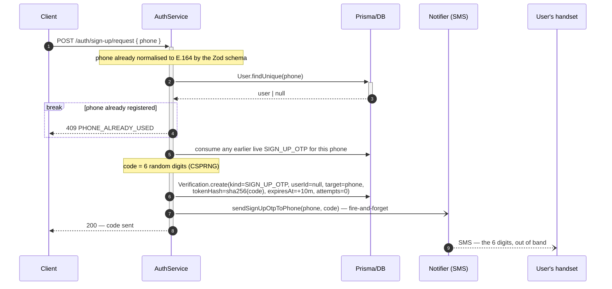
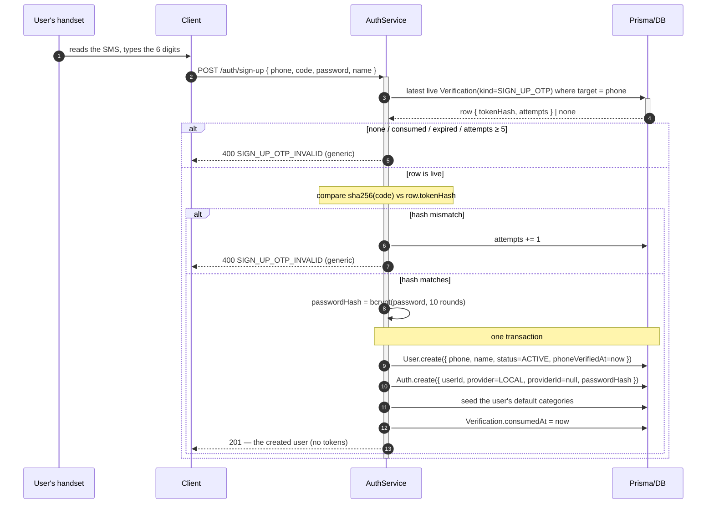

# Sign-Up (phone + OTP + password)

Create the account from a phone number, proven by a 6-digit code before anything is written. An email is
an optional add-on attached later — see [Link Email](./LINK-EMAIL.md).

> **Why the phone is the anchor.** It is the identifier every user has and remembers, it is the channel
> that proves them here, and proving it on every account is what makes
> [OTP sign-in](./LOCAL-SIGN-IN.md#mode-2--otp) a way back in for 100%
> of users. It lives on `User`, not in an `Auth(provider=PHONE)` row — see
> [the auth model](../DB-DIAGRAM.md#provider-names-the-authority-not-the-field-you-typed).

**Step 1 — Request** (`POST /auth/sign-up/request`): claim a number, receive a code.

The code leaves over a **different channel** than the one the request came in on, and the response is
returned _before_ it arrives — the send is never awaited. That out-of-band hop is the whole mechanism:
whoever holds the SIM, and only them, can complete step 2.

**Step 2 — Create** (`POST /auth/sign-up`): the code plus everything the account needs, in one request.

> **What step 1 writes: a `Verification` row, and nothing else.** No `User`, no `Auth`. Both are created
> in step 2's transaction, after the code matches. An abandoned registration therefore leaves behind one
> expiring challenge row and no account.

> **`password` and `name` are sent at step 2, not stashed at step 1.** An unverified attempt therefore
> leaves nothing behind but a number and a code hash — no password sitting in the database waiting for a
> registration that may never complete.

> **Sign-up discloses that a phone is taken — deliberately.** Unlike the password-reset flows, a sign-up
> form cannot work without confirming availability. It does make step 1 the most abusable route in the API — see
> [rate limiting](#rate-limiting) below.

> **Sign-up issues no tokens.** `201` with the user; the client follows with
> [Sign-In](./LOCAL-SIGN-IN.md). One surface mints sessions, so _Issue tokens_ has a single
> implementation to audit.

> **`phoneVerifiedAt` is stamped at creation.** Every account therefore has a proven number from its
> first moment — which is what lets SMS be a recovery channel for 100% of users, unlike email, which
> stays optional.

> **The code leaves through the notifier**, which resolves `PHONE_DRIVER` at boot.
> If `PHONE_DRIVER=log`, the code is written into the application log so the flow runs end to end without a provider account →
> [Notifier Facade Pattern](../../pattern/NOTIFIER-FACADE-PATTERN.md#the-log-drivers).

## Phone normalisation

[`VN_PHONE_REGEX`](../../../../../packages/validation/src/constants/phone.constant.ts) accepts both
`0912345678` and `+84912345678`, and `@@unique(phone)` compares strings — without one canonical form, a
single subscriber gets **two accounts**. Every phone is normalised to **E.164** before it reaches a
service:

| Where                                                                  | Value it holds                     | What it does                                                          |
| ---------------------------------------------------------------------- | ---------------------------------- | --------------------------------------------------------------------- |
| Client                                                                 | `0912345678` **or** `+84912345678` | sends either form — never asked to reformat                           |
| Zod field, run by the global `ZodValidationPipe` before the controller | either → `+84912345678`            | `.trim()` → `.regex(VN_PHONE_REGEX)` → `.transform(normalizeVnPhone)` |
| `AuthService`, Prisma                                                  | `+84912345678`                     | uses it as received — never normalises                                |
| `User.phone`                                                           | `+84912345678`                     | the only form ever stored                                             |

> **On the Zod field, not in the service.** The pipe is global, so declaring the field normalises every
> route that takes a phone.

## Rate limiting

`POST /auth/sign-up/request` is the **most exposed route in the API**: public, requiring no account, and
accepting **any** number — so every request is billable and the recipient is attacker-chosen.

**A network `PHONE_DRIVER` must not be enabled until all of this exists**:

- per-IP **and** per-number throttling (`@nestjs/throttler`);
- a 30-60s resend cooldown and a daily per-number cap, both counted off the `Verification` rows these
  flows already write — no new table;
- an alert on spend, plus the provider's own geographic restrictions.

> **Rate limiting is out of scope elsewhere in these docs.** The per-row attempt cap stops one code from
> being guessed; it does not limit how many codes a caller can cause to be sent. Nothing else in the
> design should be read as providing that.
