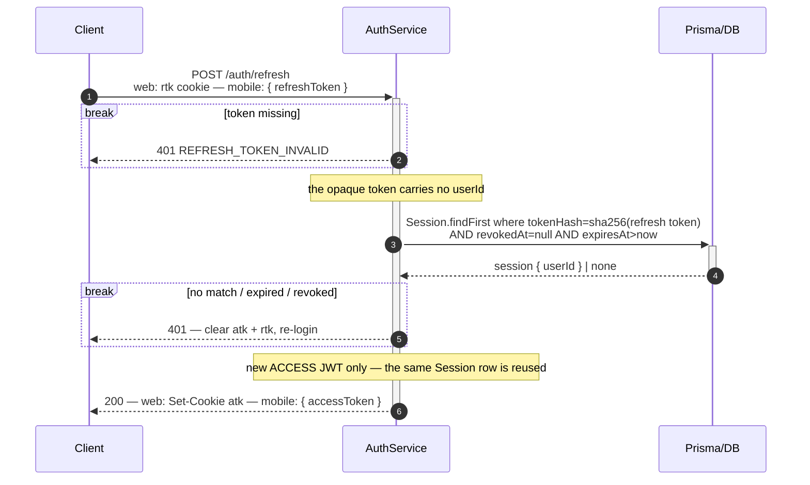

# Token Refresh

Silent renewal: trade the refresh token for a fresh access token. No rotation.

> **Why the refresh token is opaque, not a JWT.** It must be **revocable** (logout, password reset) and
> is **looked up** on every refresh, so its validity depends on server state — exactly the case where a
> reference token is correct and a self-verifying one is not; signing it as a JWT and storing
> `SHA-256(jwt)` would only throw both JWT powers away, since the value is hashed into an opaque blob and
> its signature never verified. The raw value is 32 random bytes; only its **SHA-256** hash is stored
> (`Session.tokenHash`) — deterministic lookup-by-hash, and a 256-bit input needs no salt.

> **Carried per platform.** **web** — the `rtk` `httpOnly` cookie, path-scoped to `/auth`; **mobile** —
> `{ refreshToken }` in the request body, read from the app's secure store.

The `Session` row is created at [sign-in](./LOCAL-SIGN-IN.md), and dies when it is revoked at
[logout](./LOGOUT.md) or on a password [reset](./PASSWORD-RESET-EMAIL-LINK.md) — a revoked or expired
row fails the lookup above and forces a re-login.

> **No rotation.** The same refresh token is reused for 7 days: the client is first-party and
> confidential (our own apps over HTTPS, cookie `httpOnly`) per RFC 9700 §4.14, and compromise is
> bounded by `expiresAt` plus manual revoke.
