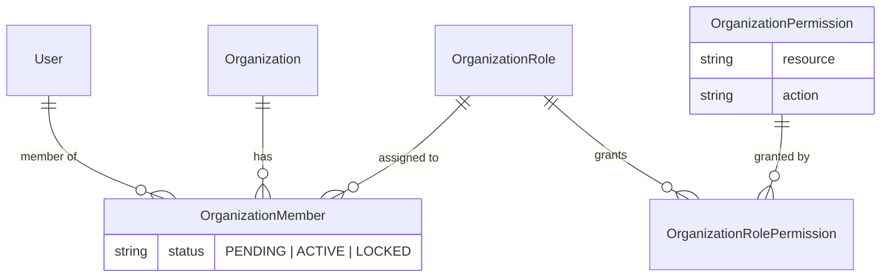

# RBAC & ReBAC Pattern

Authentication answers **who is calling**.
Authorization answers a different question — **is this caller allowed to do this?**

This document is the authorization pattern: the two models it rests on, the enforcement planes,
the data model and decision engine behind each, and how a route opts into one. What one concrete
request goes through is a separate flow doc:
[RBAC-ReBAC-FLOW](../architecture/RBAC-ReBAC-FLOW.md).

> **Preconditions.** By the time authorization runs, `JwtAuthGuard` has proven the access JWT →
> `req.user.userId` ([GUARD-PATTERN](GUARD-PATTERN.md)).

---

## 1. RBAC vs ReBAC — two sources of authority

"May this user act on this thing?" has two standard answers, and they differ by **where the
authority comes from**.

**RBAC — Role-Based Access Control.** Authority comes from a **role in a container** — an
organization, a team, a workspace. _"You are an admin of Acme"_ → you may do admin things to Acme's
resources. The grant is `user → role → container`.

**ReBAC — Relationship-Based Access Control.** Authority comes from a **direct relationship between
you and a specific resource** (or a chain of relationships). _"This document is shared with you"_ — without being a member of its organization.
The grant is a single **edge**, access need not follow container membership, and it is scoped to that one resource.

### When to use which

One question decides it:

> Can someone legitimately act on a resource **WITHOUT holding a matching role in its container**?
> - **No** — access is always derivable from a container role → **RBAC**.
> - **Yes** — access comes from a per-resource grant, or a relationship that crosses the container →
>   **ReBAC**.

Three signals that call for ReBAC:

1. **Per-resource sharing** — access granted on one specific resource to specific users, not by role
   (a shared document).
2. **Cross-boundary access** — a user outside the resource's container still has access (an outside
   collaborator; an invited operator).
3. **Relationship inheritance** — access flows along an edge chain ("you may read a file if you may
   read its parent folder").

### They are complementary, not rivals

Most systems use both: coarse RBAC as the guardrail around a container, ReBAC for sharing and
delegation inside or across it. One principle spans both — **each authorization decision has a
single authority.** You do not answer one "may you act here?" with two competing models; a route
belongs to one model, or one model's relevant grant is folded into the other as an explicit rule.

This codebase uses both: §2–§6 are its RBAC, §7 its ReBAC. How each maps to concrete routes is §6.

---

## 2. The problem

Every **organization-document** decision reduces to one question:

> May user **U** perform action **A** on resource **R** — inside organization **O**?

Answering it per-user would mean storing a grant for every user × action × resource cell. Instead,
users are grouped into **roles** (Owner, Member, …) and grants attach to the role — that is the
"R" in RBAC. The organization dimension is not optional: the same user is a member of many
organizations and holds a **different role in each**, carried by their `OrganizationMember` row. So
the question becomes: _within O, does U's role hold a permission matching (A, R)?_

One business requirement shapes the whole design: **which role may do what is per-organization
configuration, not code** — the organization owner creates roles and edits the role–permission
matrix, and the change takes effect immediately. That forces a strict split:

| Layer                                                    | Nature                          | Lives in                                                     |
| -------------------------------------------------------- | ------------------------------- | ------------------------------------------------------------ |
| **Mechanism** — how a decision is evaluated and enforced | code, stable                    | `packages/permission` engine + `OrganizationPermissionGuard` |
| **Policy** — who may do what                             | data, editable per organization | `OrganizationRolePermission` rows in the DB                  |

Code never asks "is this user an `OWNER`?" — role codes are policy. Code only ever asks
`can(action, resource)`.

### Terminology

Used consistently below and in the codebase — no synonyms:

| Term           | Meaning                                                                                          |
| -------------- | ----------------------------------------------------------------------------------------------- |
| **action**     | the verb — a `PERMISSION_ACTION` value: `CREATE` `READ` `UPDATE` `DELETE` `MANAGE`               |
| **resource**   | the thing acted on — a `PERMISSION_RESOURCE` value: `PROJECT` `INVOICE` `TOUR` `ALL` …           |
| **permission** | one `OrganizationPermission` row = one _(resource, action)_ cell the whole platform can grant    |
| **role**       | a per-organization named bundle of permissions (`OrganizationRole` + its granted permissions)    |
| **membership** | one `OrganizationMember` row = user U belongs to organization O with one role and a status       |
| **rule**       | a permission after translation into CASL's format (inside the engine only)                      |
| **ability**    | the CASL object built from a user's rules; the thing that answers `can()`                        |

CASL's own vocabulary calls the second axis a **subject**; our column is named `resource`. They are
the same axis — §5 maps one onto the other.

---

## 3. The data model

The chain, per organization:



- `OrganizationRole` is **per organization** (`organizationId`), unique on `(organizationId, code)`;
  the roles seeded for every organization (`OWNER`, `MEMBER`) are its system roles.
- `OrganizationPermission` is a **platform-wide catalog** of `(resource, action)` cells, unique on
  the pair — it is the menu of grantable cells, shared by all organizations.
- `OrganizationRolePermission` is the join: granting a permission to a role is inserting one row,
  revoking is deleting it.
- `OrganizationMember` is the membership — it ties user U to organization O, carries the `status`
  (`PENDING | ACTIVE | LOCKED`) and the one `OrganizationRole` U holds in O.
- `action` / `resource` values come from two hand-written constants in
  [`packages/permission`](../../../../packages/permission): `PERMISSION_ACTION` and
  `PERMISSION_RESOURCE`.
- `DEFAULT_ROLE_PERMISSIONS` (same package, also hand-written — nothing here comes from a library)
  is a plain data object mapping each system role code to its granted `(action, resource)` cells —
  the **factory-default matrix**. The seed upserts it into `OrganizationRolePermission` rows for
  every organization; from then on the DB rows are the source of truth (the owner edits them in the
  settings UI), and this object only defines what a fresh organization starts with. Changing that
  default = editing this one file and reseeding — no other code moves.

### Invariants the configuration can never break

Policy is user-editable, so three guardrails are hard-coded into the mechanism:

1. **`OWNER` is locked to `[{ MANAGE, ALL }]`** — full access, not editable.
2. **Configuration edits matrix _cells_, never _axes_.** Actions and resources are code-defined
   enums; an organization can change who gets a cell, not invent new verbs or resources.
3. **Data scope is not a permission.** Organization isolation (a caller must be an `ACTIVE` member
   of the record's organization) and record ownership (the creator may act on their own record) are
   system invariants enforced by `OrganizationPermissionGuard` on every request regardless of what
   the matrix says ([GUARD-PATTERN](GUARD-PATTERN.md)). A role granted `READ INVOICE` reads invoices
   _of the organization the caller belongs to_ — never beyond.

---

## 4. The decision function — why it ends up needing a library

At runtime, a user's role in an organization flattens into a list of permissions — for example a
plain Member:

```ts
const permissionList = [
  { action: 'READ', resource: 'PROJECT' },
  { action: 'READ', resource: 'INVOICE' },
];
```

The one piece still missing is a **decision function**: `can('UPDATE', 'INVOICE')` → `true` / `false`.

### Step 1 — the naive version works

Two string comparisons:

```ts
const hasPermission = (permissionList: PermissionRule[], action: string, resource: string) =>
  permissionList.some((p) => p.action === action && p.resource === resource);

hasPermission(permissionList, 'READ', 'PROJECT'); // a row matches → true ✓
hasPermission(permissionList, 'UPDATE', 'INVOICE'); // no row matches → false ✓
```

If the model stopped here, no library would be justified. It doesn't stop here — the model grows
in three directions, and each one lands on this function.

### Step 2 — wildcards break it

`OWNER` is stored as **one row**, `{ MANAGE, ALL }` — "every action on every resource" — not as the
whole matrix written out. Feed that to the naive version:

```ts
hasPermission([{ action: 'MANAGE', resource: 'ALL' }], 'UPDATE', 'INVOICE');
// 'MANAGE' === 'UPDATE' → false · 'ALL' === 'INVOICE' → false
// → false: OWNER is denied everything. Wrong.
```

The fix is more comparisons:

```ts
permissionList.some(
  (p) =>
    (p.action === action || p.action === PERMISSION_ACTION.MANAGE) &&
    (p.resource === resource || p.resource === PERMISSION_RESOURCE.ALL),
);
```

Still writable — but "`MANAGE` swallows every action, `ALL` swallows every resource" is now a
semantic rule the implementation must encode correctly by hand.

### Step 3 — `conditions` turns it into an interpreter

A grant may need to narrow to _rows the caller owns_ — for example _"a Member may `UPDATE` a `TOUR`
— only one they created"_:

```ts
{ action: 'UPDATE', resource: 'TOUR', conditions: { createdByUserId: '<userId>' } }
```

Deciding that is no longer comparing two strings. The function must now receive the concrete
record being touched and evaluate the JSON against it — equality? membership in a list? nested
fields?

Today this ownership rule is kept as a **code invariant** in `OrganizationPermissionGuard`
(§3 invariant 3, [GUARD-PATTERN](GUARD-PATTERN.md)), not as a stored condition — so `conditions`
stays unused. It exists in the design for the day ownership becomes owner-configurable per role;
when that grant arrives, it slots into the same engine unchanged (§5.3).

### Step 4 — one question, two runtimes

The mobile app hides tabs and buttons by asking the exact same question the API enforces, so the
decision function must run in both the API and the mobile app. Two separate concerns here — be
precise about what solves which:

- **A shared package** solves _drift_: one implementation in `packages/permission` instead of two
  hand-rolled copies disagreeing (the app shows an action the API rejects). True with or without a
  library.
- **A library** solves the _engine_: whatever sits inside that package — the wildcard semantics of
  step 2, the condition interpreter of step 3.

---

## 5. The library: CASL

### 5.1 What CASL is

[CASL](https://casl.js.org) is one core package plus optional add-ons, and the relationship
between them matters more than the list:

- **`@casl/ability` is the core, and it is self-sufficient.** It compiles grants into an
  **ability** that answers `can(action, resource)` in memory. Using CASL means using this package;
  nothing else is required.
- **`@casl/prisma` and `@casl/mongoose` are add-ons, they do not contain the core — they depend on it.** Each is a **translator** — `@casl/prisma` emits a Prisma
  `WhereInput`, `@casl/mongoose` a Mongoose query — so the _database_ can apply the user's
  permissions while filtering rows.

Same rules, two consumers, two different questions:

| Consumer                                                 | Question it answers                                                           | Where it runs                             |
| -------------------------------------------------------- | ----------------------------------------------------------------------------- | ----------------------------------------- |
| `@casl/ability` — `ability.can('READ', 'INVOICE')`       | _may U do A on R?_ — yes/no, for one object already in hand                   | in memory (Node / React Native)           |
| `@casl/prisma` — `accessibleBy(ability).ofType('Invoice')` | _which rows may U see?_ — a `WHERE` clause built from the rules' `conditions` | in the database, before any object exists |

### 5.2 Why we use `@casl/ability`

§4 concluded that the decision function is the one piece worth a library — `@casl/ability` is
exactly that piece, packaged. It does not know about roles, organizations, HTTP or Prisma; all of
that stays ours (§3, §6). Its features map one-to-one onto the three growth directions that broke
the hand-written version:

| §4 broke on             | `@casl/ability` ships                                                                                                                                                                                                                                    |
| ----------------------- | ------------------------------------------------------------------------------------------------------------------------------------------------------------------------------------------------------------------------------------------------------- |
| Step 2 — wildcards      | `manage` (any action) and `all` (any resource) are reserved keywords with exactly the swallow-everything semantics written by hand above                                                                                                                 |
| Step 3 — conditions     | the condition interpreter is already written: a rule can carry exactly the JSON a conditioned grant would store (e.g. `{ createdByUserId: '<userId>' }`), and the engine evaluates it against the record itself — we never build the interpreter of step 3 |
| Step 4 — two runtimes   | the engine is isomorphic — the same code runs in Node and React Native — so the shared package contains no engine we maintain ourselves                                                                                                                  |

**Deliberately not used: `@casl/prisma`.** Nothing needs permission-based row filtering yet (no
grant uses `conditions` — record ownership is a code invariant, §4 step 3 — so there is nothing to
translate into a `WHERE` clause). When a conditioned grant arrives, `@casl/prisma` bolts onto the
same rules without changing anything in this pattern.

### 5.3 How `@casl/ability` works

The library does everything in two stages: **declare first, ask later**.

| #   | Name                                | Stage   | What it is                                                                                                                                |
| --- | ----------------------------------- | ------- | ---------------------------------------------------------------------------------------------------------------------------------------- |
| 1   | **rule**                            | declare | one statement of permission — "action X is allowed on resource Y".                                                                       |
| 2   | **`AbilityBuilder`**                | declare | the collector. Each call to its `can(action, resource)` appends one rule to an internal list — it _declares_, it checks nothing.         |
| 3   | **`build()`**                       | compile | closes the declaration: compiles the collected rules into an **ability**.                                                                |
| 4   | **`ability.can(action, resource)`** | ask     | the actual check: `true` if any rule matches. Wildcard matching (`manage`, `all`) and condition matching happen here, inside the engine. |

```ts
const { can, build } = new AbilityBuilder(createMongoAbility);

// ─── DECLARE: each call writes ONE rule into the builder's internal rule list ─────
can('READ', 'PROJECT'); // rule list now: [ READ PROJECT ]
can('READ', 'INVOICE'); // rule list now: [ READ PROJECT, READ INVOICE ]

// ─── COMPILE: seal the rule list into an ability ─────
const ability = build();

// ─── ASK: the ability matches each question against its rules ─────
ability.can('READ', 'PROJECT'); // → true — rule 1 matches
ability.can('UPDATE', 'INVOICE'); // → false — no rule matches
```

Two things to read from this example:

- **Where the rules live: inside CASL, nowhere else.** Each `can(…)` call in DECLARE writes one
  rule into the builder's internal list; `build()` seals that list into the ability; every
  `ability.can(…)` matches against it.
- **`createMongoAbility` does not mean MongoDB.** It is the compile target `build()` produces, and
  "Mongo" names the _notation_ conditions are written in (`{ field: value }`, `$in`, …) — a
  compact, well-known way to say "does this object match?". CASL evaluates those conditions
  itself, in memory. No MongoDB is involved anywhere; the app's database is PostgreSQL through
  Prisma (§3).

### Reserved keywords — the full list

Actions and resources are, to CASL, just strings — it accepts anything (`'READ'`, `'INVOICE'`, …)
and matches them by comparison. Exactly **two** string values are reserved and treated specially
by the engine:

| Reserved keyword | Meaning to the engine                                          |
| ---------------- | -------------------------------------------------------------- |
| `manage`         | as an **action** in a rule: matches _any_ action asked about   |
| `all`            | as a **subject** in a rule: matches _any_ resource asked about |

So a single rule `can('manage', 'all')` makes every `ability.can(…)` question return `true`. Our
`MANAGE` / `ALL` constants map onto these two keywords (below) — the names differ, the meaning is
identical.

### The lifecycle in our code: `getUserAbility`

Everything above wraps into one function in
[`packages/permission`](../../../../packages/permission) — the only place in the codebase that
touches CASL's construction API. Give it a user's permissions, get back the ability; callers
just call it, then ask `ability.can(…)`.

```ts
// packages/permission
export const getUserAbility = (permissionList: PermissionRule[]) => {
  const { can, build } = new AbilityBuilder(createMongoAbility);

  // ─── DECLARE: one OrganizationPermission row → one rule ─────
  for (const permission of permissionList) {
    const caslAction =
      permission.action === PERMISSION_ACTION.MANAGE ? 'manage' : permission.action;
    const caslSubject =
      permission.resource === PERMISSION_RESOURCE.ALL ? 'all' : permission.resource;

    can(caslAction, caslSubject);
  }

  // ─── COMPILE: seal the rules into the ability ─────
  return build();
};
```

`conditions` is ignored today. When a conditioned grant arrives, this function passes it as the
third argument of `can(…)` — callers change nothing.

---

## 6. In this codebase

The two models of §1 map onto concrete mechanisms here. Every decision the API makes is one of three:

| The question                                                                     | Applies to                                                                              | Enforced by                                    |
| -------------------------------------------------------------------------------- | --------------------------------------------------------------------------------------- | ---------------------------------------------- |
| Does your **role in the organization** permit this action on this resource?      | an organization's documents (`Booking`, `Invoice`, `Tour`, `Trip`, `Car`, the org directory, …) | `OrganizationPermissionGuard` (RBAC — below)   |
| Are you **assigned to this tour's execution**?                                   | tour execution (crew assignments, tour receipt payments)                                | `TourImplementationAccessGuard` (ReBAC — §7)                 |
| Is this **your own** record?                                                     | a record's creator; a personal record with no organization                             | a branch inside `OrganizationPermissionGuard`  |

The first two are **enforcement planes**, each with a guard; ownership is a short-circuit inside the
RBAC guard, not a third plane.

**The one-guard rule.** After `JwtAuthGuard` (authentication), a route carries **exactly one**
authorization guard — never both:

| Route acts on…              | Guards                                        |
| --------------------------- | --------------------------------------------- |
| an organization's documents | `JwtAuthGuard, OrganizationPermissionGuard`   |
| a tour's execution          | `JwtAuthGuard, TourImplementationAccessGuard`               |

**The one exception — `ReceiptPayment` mutations.** A receipt payment attaches to different parents
(a tour implementation, a booking, an invoice, a project, or nothing), and a guard — running before
the handler — sees only the id in the URL, so it cannot yet know the parent. Such a route carries
only `JwtAuthGuard`; the plane is selected **inside the service**, once the parent is known (§7.4).

The rest of this section details the **RBAC** guard; the tour-implementation-access guard is §7.

The engine is already on the table: `getUserAbility` (§5.3), shared by the API and mobile. What
the API adds is the **enforcement** — how a route declares the permission it requires, and what
checks it on every request: `@CheckAbility` + `OrganizationPermissionGuard`. Both are ours, not
CASL's. Default policy was already covered in §3 (`DEFAULT_ROLE_PERMISSIONS` → seed); the full
default grid is [ROLE-PERMISSION-MATRIX](../reference/ROLE-PERMISSION-MATRIX.md), and what one
request goes through end-to-end is [RBAC-ReBAC-FLOW](../architecture/RBAC-ReBAC-FLOW.md).

**The decorator** — a decorator can attach metadata to a route handler; this one attaches exactly
one fact and performs no check ([DECORATOR-PATTERN](DECORATOR-PATTERN.md)):

```ts
// src/_core/decorators/check-ability.decorator.ts
export const CHECK_ABILITY_KEY = 'checkAbility';

// The (action, resource) cell a route requires — what OrganizationPermissionGuard reads back.
export interface CheckAbilityMetadata {
  action: PermissionAction;
  resource: PermissionResource;
}

// ─── Stamp the route with the (action, resource) cell it requires ─────
// SetMetadata only stores the pair under CHECK_ABILITY_KEY on the handler.
// Nothing runs at request time here — OrganizationPermissionGuard reads it back.
export const CheckAbility = (action: PermissionAction, resource: PermissionResource) =>
  SetMetadata(CHECK_ABILITY_KEY, { action, resource });
```

**The guard** — a guard is code NestJS runs _before_ the route handler, with the power to reject
the request ([GUARD-PATTERN](GUARD-PATTERN.md)). This one carries the weight a single-tenant
guard never does: it **resolves the organization** the request acts in before it can ask anything,
then enforces the two data-scope invariants (§3) and finally runs the ASK side of §5.3. One generic
guard replaces the per-resource mutation guards it supersedes:

```ts
// src/_core/guards/organization-permission.guard.ts
@Injectable()
export class OrganizationPermissionGuard implements CanActivate {
  constructor(
    private readonly reflector: Reflector,
    private readonly prismaService: PrismaService,
  ) {}

  async canActivate(context: ExecutionContext): Promise<boolean> {
    // ─── Step 1: Read the cell @CheckAbility stamped on this route ─────
    // A route without the metadata is not permission-guarded: pass it through untouched.
    const requiredCell = this.reflector.get<CheckAbilityMetadata | undefined>(
      CHECK_ABILITY_KEY,
      context.getHandler(),
    );
    if (!requiredCell) {
      return true;
    }

    const request = context.switchToHttp().getRequest<AuthenticatedRequest>();
    const { userId } = request.user;

    // ─── Step 2: Resolve the organization this request acts in ─────
    // A record route (:id present) is resolved through the target record — which also yields
    // its creator for the ownership invariant; otherwise organizationId comes from param/body.
    const { organizationId, createdByUserId } = await this.resolveResourceOwnership(
      request,
      requiredCell.resource,
    );

    // ─── Personal (non-organization) record: no membership or matrix applies — ownership only ─────
    if (!organizationId) {
      if (createdByUserId && createdByUserId === userId) {
        return true;
      }
      throw new OrganizationPermissionDeniedException();
    }

    // ─── Step 3: Membership invariants — enforced regardless of the matrix (§3, invariant 3) ─────
    const member = await this.prismaService.organizationMember.findFirst({
      where: { userId, organizationId },
      select: { status: true },
    });
    if (!member) {
      throw new OrganizationNotMemberException(); // HTTP 403, ORGANIZATION_NOT_MEMBER
    }
    if (member.status === ORGANIZATION_MEMBER_STATUS.LOCKED) {
      throw new OrganizationMemberLockedException(); // HTTP 403, ORGANIZATION_MEMBER_LOCKED
    }

    // ─── Step 4: Ownership invariant — the record's creator may always act on it (§3, invariant 3) ─────
    if (createdByUserId && createdByUserId === userId) {
      return true;
    }

    // ─── Step 5: Ask the engine (§5.3) with the caller's role in THIS organization ─────
    // Read fresh from the DB so an owner's matrix edit takes effect on the NEXT request.
    const permissionList = await this.prismaService.organizationRolePermission.findMany({
      where: {
        organizationRole: {
          organizationId,
          organizationMembers: { some: { userId } },
        },
      },
      select: { organizationPermission: { select: { action: true, resource: true } } },
    });
    const ability = getUserAbility(permissionList.map((row) => row.organizationPermission));
    if (!ability.can(requiredCell.action, requiredCell.resource)) {
      throw new OrganizationPermissionDeniedException(); // HTTP 403, ORGANIZATION_PERMISSION_DENIED
    }
    return true;
  }
}
```

`resolveResourceOwnership` is the single place that knows how each `resource` finds its
organization: for a record route it loads `{ organizationId, createdByUserId }` from that
resource's table by `:id` (`resolveOwnershipFromRecord`); for a collection or create route it reads
`organizationId` from the request params or body (`resolveOwnershipFromRequest`). Keeping that map in
one method is what lets one guard serve every resource — instead of one hand-copied guard class per
resource.

**A route opts in by carrying both** — the guard via `@UseGuards`, the cell via `@CheckAbility`:

```ts
@UseGuards(JwtAuthGuard, OrganizationPermissionGuard)
@CheckAbility(PERMISSION_ACTION.UPDATE, PERMISSION_RESOURCE.TOUR)
@Put(':id')
updateTour(/* … */) {}
```

What one request goes through, step by step, is [RBAC-ReBAC-FLOW](../architecture/RBAC-ReBAC-FLOW.md).

---

## 7. The tour implementation access plane

### 7.1 Why RBAC is not enough

A tour is executed by people **assigned to it**: a director (`DIRECTOR` — "Điều hành"), tour guides,
drivers. An organization may staff a tour with members **it invited from another organization** — the
assignee is not necessarily a member of the tour's own organization. Their authority to act inside
the tour (add a receipt payment, edit the crew) comes from **the assignment**, not from an
organization role.

RBAC (§2) answers "are you a member of the owning org, and does your role permit it?". For an
invited director that answer is *no* — they are not a member — yet they are legitimately in charge.

The question that fits is a **relationship** one: _is there an assignment edge between this user and
this tour?_ This is relationship-based access control (ReBAC), a separate plane.

### 7.2 The data — a relationship, not a role bundle

The grant lives on the **edge** between a user and a tour implementation, in two tables:

- `MemberAssignedTourImplementation` — links an `OrganizationMember` to a `TourImplementation` with a
  `role` (`CREATOR`, `DIRECTOR`). The linked member may belong to any organization.
- `UserAssignedTourImplementation` — links a `User` to an assignment slot with a `role`
  (`TOUR_GUIDE`, `DRIVER`) and a per-assignment `permissions[]` — a fine-grained list scoped to that
  one assignment (e.g. whether this tour guide may read the tour-guide receipt payments).

Nothing here is an organization role; the authority is the edge itself. Roles and permission strings
are code-defined constants (like the RBAC axes), not free text.

### 7.3 The decision — `assertTourImplementationAccess`

One function answers the access question — the counterpart of `getUserAbility` for this plane:

> Given a `tourImplementationId`, a `userId`, and a `requiredAccessLevel` (the bar the route demands),
> the caller passes if they are the `OWNER` of the tour's organization (owner-implies-access), or they
> hold the edge the bar requires: `MANAGER` needs a **member-assigned** row; `ASSIGNEE` also accepts a
> **user-assigned** row.

`requiredAccessLevel` is the route's *requirement*, not the caller's level — the two halves of every
authorization decision. The **required** half is declared on the route (`@CheckTourImplementationAccess`,
like `@CheckAbility`'s `(action, resource)` cell); the **held** half — what relationship the caller
actually has — the engine derives from the DB (`isOrganizationOwner` / `isMemberAssigned` /
`isUserAssigned`). The check is whether *held* clears *required*.

The bar splits the two tiers of authority on a tour. **MANAGER** is the crew-management tier — only an
assigned organization member (creator/director), or the owner, may add crew, edit the implementation,
or manage assignments; this is what `TourImplementationAccessGuard` passes. **ASSIGNEE** is the wider "on this tour
at all" tier — a member *or* an assigned tour guide/driver, or the owner — used where an assigned user
legitimately acts, such as a receipt payment on the tour (Flow 3). The tiers nest: MANAGER ⊂ ASSIGNEE, so
a higher bar is stricter. The default is `MANAGER` — the strictest bar — so an under-specified route
fails **closed** (denies too much) rather than open.

The owner clause is **owner-implies-access**: the organization owner is never locked out of a
tour they own, expressed as one rule inside this plane.

### 7.4 Enforcement

Two shapes, chosen by whether the route's target maps cleanly to a tour implementation:

- **`TourImplementationAccessGuard`** — for routes whose id resolves to a tour implementation (managing the
  crew, editing an assignment). Like the RBAC guard it resolves the `tourImplementationId` from the
  route (directly, or through the assignment/record it names), then calls `assertTourImplementationAccess`.
- **Service-selected — `ReceiptPayment` mutations.** Because a receipt payment's plane follows its
  parent (§6), its route carries only `JwtAuthGuard`; the service inspects the parent and calls
  `assertTourImplementationAccess` for a tour-execution parent, the organization check for an org document,
  or the ownership check for a personal one. This is the one place a plane is chosen at runtime.

### 7.5 The boundary — one plane per route

Classifying a route is a single question: **does its authority come from an organization role, or
from a tour assignment?** Organization documents → RBAC (§6). Tour execution → tour implementation access.

---