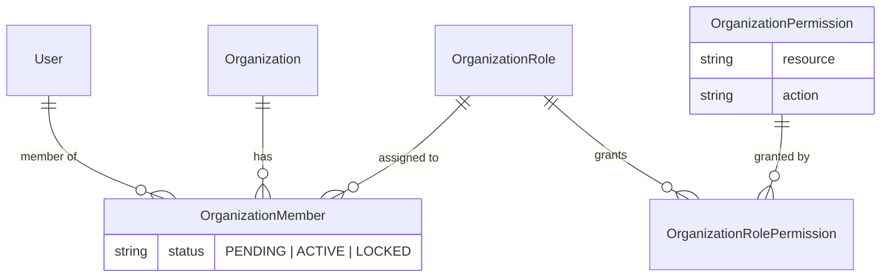

# RBAC & ReBAC Pattern

Authentication answers **who is calling**.
Authorization answers a different question — **is this caller allowed to do this?**

This document is the **mechanism** pattern: the two models it rests on, the enforcement planes,
the data model and decision engine behind each, and how a route opts into one. Two companion
docs split off from it:

- **Which model a new rule belongs to, and at what granularity** — the decision rules — is
  [PERMISSION-GRANULARITY-PATTERN](PERMISSION-GRANULARITY-PATTERN.md).
- What one concrete request goes through is the flow doc:
  [RBAC-ReBAC-FLOW](../architecture/RBAC-ReBAC-FLOW.md).

> **Preconditions.** By the time authorization runs, `JwtAuthGuard` has proven the access JWT →
> `req.user.userId` ([GUARD-PATTERN](GUARD-PATTERN.md)).

---

## 1. RBAC vs ReBAC — two sources of authority

"May this user act on this thing?" has two standard answers, and they differ by **where the
authority comes from**.

**RBAC — Role-Based Access Control.** Authority comes from a **role in a container** — an
organization, a team, a workspace. _"You are an admin of Acme"_ → you may do admin things to Acme's
resources. The grant is `user → role → container`.

**ReBAC — Relationship-Based Access Control.** Authority comes from a **direct relationship between
you and a specific resource** (or a chain of relationships). _"This document is shared with you"_ — without being a member of its organization.
The grant is a single **edge**, access need not follow container membership, and it is scoped to that one resource.

### When to use which

Which model a rule belongs to — and every other granularity decision (new resource vs scope vs
relationship, new verbs, what gets seeded) — is decided by
[PERMISSION-GRANULARITY-PATTERN](PERMISSION-GRANULARITY-PATTERN.md) (§1 sources of authority,
§5 decision procedure). This doc assumes that classification is already made.

### They are complementary, not rivals

Most systems use both: coarse RBAC as the guardrail around a container, ReBAC for sharing and
delegation inside or across it. One principle spans both — **each authorization decision has a
single authority.** You do not answer one "may you act here?" with two competing models; a route
belongs to one model, or one model's relevant grant is folded into the other as an explicit rule.

This codebase uses both: §2–§6 are its RBAC, §7 its ReBAC. How each maps to concrete routes is §6.

---

## 2. The problem

Every **organization-document** decision reduces to one question:

> May user **U** perform action **A** on resource **R** — inside organization **O**?

Answering it per-user would mean storing a grant for every user × action × resource cell. Instead,
users are grouped into **roles** (Owner, Member, …) and grants attach to the role — that is the
"R" in RBAC. The organization dimension is not optional: the same user is a member of many
organizations and holds a **different role in each**, carried by their `OrganizationMember` row. So
the question becomes: _within O, does U's role hold a permission matching (A, R)?_

One business requirement shapes the whole design: **which role may do what is per-organization
configuration, not code** — the organization owner creates roles and edits the role–permission
matrix, and the change takes effect immediately. That forces a strict split:

| Layer                                                    | Nature                          | Lives in                                                     |
| -------------------------------------------------------- | ------------------------------- | ------------------------------------------------------------ |
| **Mechanism** — how a decision is evaluated and enforced | code, stable                    | `packages/permission` engine + `OrganizationPermissionGuard` |
| **Policy** — who may do what                             | data, editable per organization | `OrganizationRolePermission` rows in the DB                  |

Code never asks "is this user an `OWNER`?" — role codes are policy. Code only ever asks
`can(action, resource)`.

### Terminology

Used consistently below and in the codebase — no synonyms:

| Term           | Meaning                                                                                       |
| -------------- | --------------------------------------------------------------------------------------------- |
| **action**     | the verb — a `PERMISSION_ACTION` value: `CREATE` `READ` `UPDATE` `DELETE` `MANAGE`            |
| **resource**   | the thing acted on — a `PERMISSION_RESOURCE` value: `PROJECT` `INVOICE` `TOUR` `ALL` …        |
| **permission** | one `OrganizationPermission` row = one _(resource, action)_ cell the whole platform can grant |
| **role**       | a per-organization named bundle of permissions (`OrganizationRole` + its granted permissions) |
| **membership** | one `OrganizationMember` row = user U belongs to organization O with one role and a status    |
| **rule**       | a permission after translation into CASL's format (inside the engine only)                    |
| **ability**    | the CASL object built from a user's rules; the thing that answers `can()`                     |

CASL's own vocabulary calls the second axis a **subject**; our column is named `resource`. They are
the same axis — §5 maps one onto the other.

---

## 3. The data model

The chain, per organization:



---

## 4. The decision function — why it ends up needing a library

At runtime, a user's role in an organization flattens into a list of permissions — for example a
plain Member:

```ts
const permissionList = [
  { action: 'READ', resource: 'PROJECT' },
  { action: 'READ', resource: 'INVOICE' },
];
```

The one piece still missing is a **decision function**: `can('UPDATE', 'INVOICE')` → `true` / `false`.

### Step 1 — the naive version works

Two string comparisons:

```ts
const hasPermission = (permissionList: PermissionRule[], action: string, resource: string) =>
  permissionList.some((p) => p.action === action && p.resource === resource);

hasPermission(permissionList, 'READ', 'PROJECT'); // a row matches → true ✓
hasPermission(permissionList, 'UPDATE', 'INVOICE'); // no row matches → false ✓
```

If the model stopped here, no library would be justified. It doesn't stop here — the model grows
in three directions, and each one lands on this function.

### Step 2 — wildcards break it

`OWNER` is stored as **one row**, `{ MANAGE, ALL }` — "every action on every resource" — not as the
whole matrix written out. Feed that to the naive version:

```ts
hasPermission([{ action: 'MANAGE', resource: 'ALL' }], 'UPDATE', 'INVOICE');
// 'MANAGE' === 'UPDATE' → false · 'ALL' === 'INVOICE' → false
// → false: OWNER is denied everything. Wrong.
```

The fix is more comparisons:

```ts
permissionList.some(
  (p) =>
    (p.action === action || p.action === PERMISSION_ACTION.MANAGE) &&
    (p.resource === resource || p.resource === PERMISSION_RESOURCE.ALL),
);
```

Still writable — but "`MANAGE` swallows every action, `ALL` swallows every resource" is now a
semantic rule the implementation must encode correctly by hand.

### Step 3 — `conditions` turns it into an interpreter

A grant may need to narrow to _rows the caller owns_ — for example _"a Member may `UPDATE` a `TOUR`
— only one they created"_:

```ts
{ action: 'UPDATE', resource: 'TOUR', conditions: { createdByUserId: '<userId>' } }
```

Deciding that is no longer comparing two strings. The function must now receive the concrete
record being touched and evaluate the JSON against it — equality? membership in a list? nested
fields?

`conditions` are in use today for **scope** — a grant narrowed to a field-value subset, e.g. _"a
Member may `READ` an `INVOICE` — only `SELL` ones"_ → `conditions: { type: 'SELL' }`
([PERMISSION-GRANULARITY-PATTERN §2.3](PERMISSION-GRANULARITY-PATTERN.md)).

### Step 4 — one question, two runtimes

The mobile app hides tabs and buttons by asking the exact same question the API enforces, so the
decision function must run in both the API and the mobile app. Two separate concerns here — be
precise about what solves which:

- **A shared package** solves _drift_: one implementation in `packages/permission` instead of two
  hand-rolled copies disagreeing (the app shows an action the API rejects). True with or without a
  library.
- **A library** solves the _engine_: whatever sits inside that package — the wildcard semantics of
  step 2, the condition interpreter of step 3.

---

## 5. The library: CASL

### 5.1 What CASL is

[CASL](https://casl.js.org) is one core package plus optional add-ons, and the relationship
between them matters more than the list:

- **`@casl/ability` is the core, and it is self-sufficient.** It compiles grants into an
  **ability** that answers `can(action, resource)` in memory. Using CASL means using this package;
  nothing else is required.
- **`@casl/prisma` and `@casl/mongoose` are add-ons** — translators that fold the rules into a
  database query (`@casl/prisma` → a Prisma `WhereInput`). **We do not use them.**

Same rules, two questions — both answered by the core `@casl/ability`:

| Question                                          | How we answer it                                                                                        | Where it runs                   |
| ------------------------------------------------- | ------------------------------------------------------------------------------------------------------- | ------------------------------- |
| _may U do A on **this** record?_ — yes/no         | `ability.can('READ', subject('INVOICE', record))`                                                       | in memory (Node / React Native) |
| _**which** rows may U see?_ — filter a list       | ask `ability.can` once per candidate scope value → the readable set → a plain `WHERE … IN (…)` (§5.4)    | in memory, then the DB filters  |

### 5.2 Why we use `@casl/ability`

§4 concluded that the decision function is the one piece worth a library — `@casl/ability` is
exactly that piece, packaged. It does not know about roles, organizations, HTTP or Prisma; all of
that stays ours (§3, §6). Its features map one-to-one onto the three growth directions that broke
the hand-written version:

| §4 broke on           | `@casl/ability` ships                                                                                                                                                                                                                                      |
| --------------------- | ---------------------------------------------------------------------------------------------------------------------------------------------------------------------------------------------------------------------------------------------------------- |
| Step 2 — wildcards    | `manage` (any action) and `all` (any resource) are reserved keywords with exactly the swallow-everything semantics written by hand above                                                                                                                   |
| Step 3 — conditions   | the condition interpreter is already written: a rule can carry exactly the JSON a conditioned grant would store (e.g. `{ createdByUserId: '<userId>' }`), and the engine evaluates it against the record itself — we never build the interpreter of step 3 |
| Step 4 — two runtimes | the engine is isomorphic — the same code runs in Node and React Native — so the shared package contains no engine we maintain ourselves                                                                                                                    |

**List filtering uses the same core — no add-on.** Scoped grants exist (Invoice `SELL` / `BUY`,
[PERMISSION-GRANULARITY-PATTERN §2.3](PERMISSION-GRANULARITY-PATTERN.md)), so list routes must drop
rows the caller's scope forbids. We do it by asking the already-built ability which scope values
pass, then filtering on that set (§5.4)

### 5.3 How `@casl/ability` works

The library does everything in two stages: **declare first, ask later**.

| #   | Name                                | Stage   | What it is                                                                                                                               |
| --- | ----------------------------------- | ------- | ---------------------------------------------------------------------------------------------------------------------------------------- |
| 1   | **rule**                            | declare | one statement of permission — "action X is allowed on resource Y".                                                                       |
| 2   | **`AbilityBuilder`**                | declare | the collector. Each call to its `can(action, resource)` appends one rule to an internal list — it _declares_, it checks nothing.         |
| 3   | **`build()`**                       | compile | closes the declaration: compiles the collected rules into an **ability**.                                                                |
| 4   | **`ability.can(action, resource)`** | ask     | the actual check: `true` if any rule matches. Wildcard matching (`manage`, `all`) and condition matching happen here, inside the engine. |

```ts
const { can, build } = new AbilityBuilder(createMongoAbility);

// ─── DECLARE: each call writes ONE rule into the builder's internal rule list ─────
can('READ', 'PROJECT'); // rule list now: [ READ PROJECT ]
can('READ', 'INVOICE'); // rule list now: [ READ PROJECT, READ INVOICE ]

// ─── COMPILE: seal the rule list into an ability ─────
const ability = build();

// ─── ASK: the ability matches each question against its rules ─────
ability.can('READ', 'PROJECT'); // → true — rule 1 matches
ability.can('UPDATE', 'INVOICE'); // → false — no rule matches
```

Two things to read from this example:

- **Where the rules live: inside CASL, nowhere else.** Each `can(…)` call in DECLARE writes one
  rule into the builder's internal list; `build()` seals that list into the ability; every
  `ability.can(…)` matches against it.
- **`createMongoAbility` does not mean MongoDB.** It is the compile target `build()` produces, and
  "Mongo" names the _notation_ conditions are written in (`{ field: value }`, `$in`, …) — a
  compact, well-known way to say "does this object match?". CASL evaluates those conditions
  itself, in memory.

### Reserved keywords

Actions and resources are, to CASL, just strings — it accepts anything (`'READ'`, `'INVOICE'`, …)
and matches them by comparison. Exactly **two** string values are reserved:

| Reserved keyword | Meaning to the engine                                          |
| ---------------- | -------------------------------------------------------------- |
| `manage`         | as an **action** in a rule: matches _any_ action asked about   |
| `all`            | as a **subject** in a rule: matches _any_ resource asked about |

So a single rule `can('manage', 'all')` makes every `ability.can(…)` question return `true`. Our
`MANAGE` / `ALL` constants map onto these two keywords (below) — the names differ, the meaning is
identical.

### The lifecycle in our code: `getUserAbility`

Everything above wraps into one function in
[`packages/permission`](../../../../packages/permission) — the only place in the codebase that
touches CASL's construction API. Give it a user's permissions, get back the ability; callers
just call it, then ask `ability.can(…)`.

```ts
// packages/permission
export const getUserAbility = (permissionList: PermissionRule[]) => {
  const { can, build } = new AbilityBuilder(createMongoAbility);

  // ─── DECLARE: one OrganizationPermission row → one rule ─────
  for (const permission of permissionList) {
    const caslAction = permission.action === PERMISSION_ACTION.MANAGE ? 'manage' : permission.action;
    const caslSubject = permission.resource === PERMISSION_RESOURCE.ALL ? 'all' : permission.resource;

    // A scoped row compiles to a conditional rule; undefined conditions = whole resource.
    const conditions =
      permission.resource === PERMISSION_RESOURCE.INVOICE && permission.scope
        ? { type: permission.scope }
        : undefined;
    can(caslAction, caslSubject, conditions);
  }

  // ─── COMPILE: seal the rules into the ability ─────
  return build();
};
```


### 5.4 List filtering — ask the same ability

§5.3 answers _"may U do A on **this** record?"_ — a record already in hand. A list route asks the
opposite: _"**which** rows may U see?"_ Rather than reach for a query-translator add-on, we reuse
the ability §5.3 already built and ask it **once per candidate scope value**.

This works because a scoped resource's values are a **fixed, small code set** — Invoice type is
`SELL` / `BUY`, a code constant ([PERMISSION-GRANULARITY-PATTERN §2.3](PERMISSION-GRANULARITY-PATTERN.md)).
The list service loads the caller's permissions, builds their ability, and keeps the codes whose
READ check passes:

```ts
// InvoiceService.findInvoicesByOrganizationId
const userAbility = getUserAbility(grantedPermissionList.map((row) => row.organizationPermission));

const readableInvoiceTypeList = Object.values(INVOICE_TYPE).filter((invoiceType) =>
  userAbility.can(PERMISSION_ACTION.READ, subject(PERMISSION_RESOURCE.INVOICE, { type: invoiceType })),
);

const invoiceList = await this.prismaService.invoice.findMany({
  where: {
    AND: [
      { type: { in: readableInvoiceTypeList } }, // permission WHERE
      { organizationId },                                       // business WHERE
    ],
  },
});
```

- **One rule source, no drift.** The filter comes from the same `ability.can` the guard uses for its
  point check, over the same permission rows — `MANAGE` / `ALL` / an unscoped grant pass every code;
  a `SELL`-scoped grant passes only `SELL`.
- **Fail-closed.** No matching grant ⇒ the readable set is empty ⇒ `{ in: [] }` ⇒ zero rows.

**When this stops working.** Enumerating candidates is viable only because invoice types are a fixed
code set. A scope over an open or large domain (arbitrary ids) could not be enumerated — that case
would need a query translator (`@casl/prisma`) or a hand-built `WHERE`. No such scope exists today.

---

## 6. In this codebase

The two models of §1 map onto concrete mechanisms here. Every decision the API makes is one of three:

| The question                                                                | Applies to                                                                                      | Enforced by                                   |
| --------------------------------------------------------------------------- | ----------------------------------------------------------------------------------------------- | --------------------------------------------- |
| Does your **role in the organization** permit this action on this resource? | an organization's documents (`Booking`, `Invoice`, `Tour`, `Trip`, `Car`, the org directory, …) | `OrganizationPermissionGuard` (RBAC — below)  |
| Are you **assigned to this tour's execution**?                              | tour execution (crew assignments, tour receipt payments)                                        | `TourImplementationAccessGuard` (ReBAC — §7)  |
| Is this **your own** record?                                                | a record's creator; a personal record with no organization                                      | a branch inside `OrganizationPermissionGuard` |

The first two are **enforcement planes**, each with a guard; ownership is a short-circuit inside the
RBAC guard, not a third plane.

**The one-guard rule.** After `JwtAuthGuard` (authentication), a route carries **exactly one**
authorization guard — never both:

| Route acts on…              | Guards                                        |
| --------------------------- | --------------------------------------------- |
| an organization's documents | `JwtAuthGuard, OrganizationPermissionGuard`   |
| a tour's execution          | `JwtAuthGuard, TourImplementationAccessGuard` |

**The exception — routes enforced in the service.** A few routes cannot have their authorization
fixed by a route-level guard, because the deciding fact is known only once the handler's service
reads the record. Three classes are in this group, for three different reasons:

- **`ReceiptPayment` reads and mutations — the plane itself depends on the parent.** A receipt payment attaches
  to different parents (a tour implementation, a booking, an invoice, a project, or nothing), and a
  guard — running before the handler — sees only the id in the URL, so it cannot yet know the parent.
- **`Signature` mutations (`sign` / `cancel` / `update-url`) — no organization scope, and the rule differs per operation.** A signature carries no `organizationId` and no role matrix; authority comes
  from a direct edge — the caller must be the signature's `targetUserId`, or (when there is no target)
  its original signer — and that edge check differs per operation.
- **`AttendanceRecord` check-out / edit / delete — ownership must EXCLUDE everyone else, even the owner.**
  A punch is self-service evidence: only its creator may touch it, and no role — not even `MANAGE ALL`
  — may edit another person's record. These
  routes carry `JwtAuthGuard` only and the service asserts `record.createdByUserId === caller`.
- **`Booking` read by id (`GET /booking/:id`) — the legitimate reader may be OUTSIDE the sending org.**
  A booking is visible to three disjoint parties: a member of the **sending** org, a member of the
  **receiving** org (`organizationCustomer.clientOrganizationId` — not a member of the sender, so the
  RBAC guard's membership invariant would reject them), or a **signature target**. The deciding fact
  is the caller's relationship to the loaded record, so the route carries `JwtAuthGuard` only and
  `findBookingById` throws `BookingAccessDeniedException` unless one relationship holds.

**The decorator** — a decorator can attach metadata to a route handler; this one attaches exactly
one fact and performs no check ([DECORATOR-PATTERN](DECORATOR-PATTERN.md)):

```ts
// src/_core/decorators/check-ability.decorator.ts
export const CHECK_ABILITY_KEY = 'checkAbility';

// The (action, resource) cell a route requires — what OrganizationPermissionGuard reads back.
export interface CheckAbilityMetadata {
  action: PermissionAction;
  resource: PermissionResource;
}

// ─── Stamp the route with the (action, resource) cell it requires ─────
// SetMetadata only stores the pair under CHECK_ABILITY_KEY on the handler.
// Nothing runs at request time here — OrganizationPermissionGuard reads it back.
export const CheckAbility = (action: PermissionAction, resource: PermissionResource) =>
  SetMetadata(CHECK_ABILITY_KEY, { action, resource });
```

**The guard** — a guard is code NestJS runs _before_ the route handler, with the power to reject
the request ([GUARD-PATTERN](GUARD-PATTERN.md)). It **resolves the organization**.

```ts
// src/_core/guards/organization-permission.guard.ts
@Injectable()
export class OrganizationPermissionGuard implements CanActivate {
  constructor(
    private readonly reflector: Reflector,
    private readonly prismaService: PrismaService,
  ) {}

  async canActivate(context: ExecutionContext): Promise<boolean> {
    // ─── Step 1: Read the @CheckAbility stamped on this route ─────
    // A route without the metadata is not permission-guarded: pass it through untouched.
    const abilityMetadata = this.reflector.get<CheckAbilityMetadata | undefined>(
      CHECK_ABILITY_KEY,
      context.getHandler(),
    );
    if (!abilityMetadata) {
      return true;
    }

    const request = context.switchToHttp().getRequest<AuthenticatedRequest>();
    const { userId } = request.user;

    // ─── Step 2: Resolve the organization this request acts in ─────
    const { organizationId, createdByUserId, scopeAttributes } = await this.resolveResourceOwnership(
      request,
      abilityMetadata.resource,
    );

    // ─── Personal (non-organization) record: no membership or role matrix applies —
    if (!organizationId) {
      if (createdByUserId && createdByUserId === userId) {
        return true;
      }
      throw new OrganizationPermissionDeniedException();
    }

    // ─── Step 3: Membership invariants ─────
    const member = await this.prismaService.organizationMember.findFirst({
      where: { userId, organizationId },
      select: { status: true },
    });
    if (!member) {
      throw new OrganizationNotMemberException();
    }
    if (member.status === ORGANIZATION_MEMBER_STATUS.LOCKED) {
      throw new OrganizationMemberLockedException();
    }

    // ─── Step 4: Ownership invariant — the record's creator may always act on it ─────
    if (createdByUserId && createdByUserId === userId) {
      return true;
    }

    // ─── Step 5: Ask the engine with the caller's role in THIS organization ─────
    // Read fresh from the DB so an owner's matrix edit takes effect on the next request.
    const rolePermissionList = await this.prismaService.organizationRolePermission.findMany({
      where: {
        organizationRole: {
          organizationId,
          organizationMembers: { some: { userId } },
        },
      },
      select: {
        organizationPermission: { select: { action: true, resource: true, scope: true } },
      },
    });
    const userAbility = getUserAbility(
      rolePermissionList.map((row) => row.organizationPermission),
    );

    const resource = scopeAttributes
      ? subject(abilityMetadata.resource, scopeAttributes)
      : abilityMetadata.resource;

    const isAllowed = userAbility.can(abilityMetadata.action, resource);
    if (!isAllowed) {
      throw new OrganizationPermissionDeniedException();
    }
    return true;
  }
}
```

`resolveResourceOwnership` is the single place that knows how each `resource` finds its
organization: for a record route it loads `{ organizationId, createdByUserId }` — plus any
`scopeAttributes` the resource's scoped cells reference (e.g. `type`) — from that
resource's table by `:id` (`resolveOwnershipFromRecord`); for a collection or create route it reads
`organizationId` from the request params or body, and the scope field from the create payload
(`resolveOwnershipFromRequest`).

**A route opts in by carrying both** — the guard via `@UseGuards`, the cell via `@CheckAbility`:

```ts
@UseGuards(JwtAuthGuard, OrganizationPermissionGuard)
@CheckAbility(PERMISSION_ACTION.UPDATE, PERMISSION_RESOURCE.TOUR)
@Put(':id')
updateTour(/* … */) {}
```

What one request goes through, step by step, is [RBAC-ReBAC-FLOW](../architecture/RBAC-ReBAC-FLOW.md).

---
