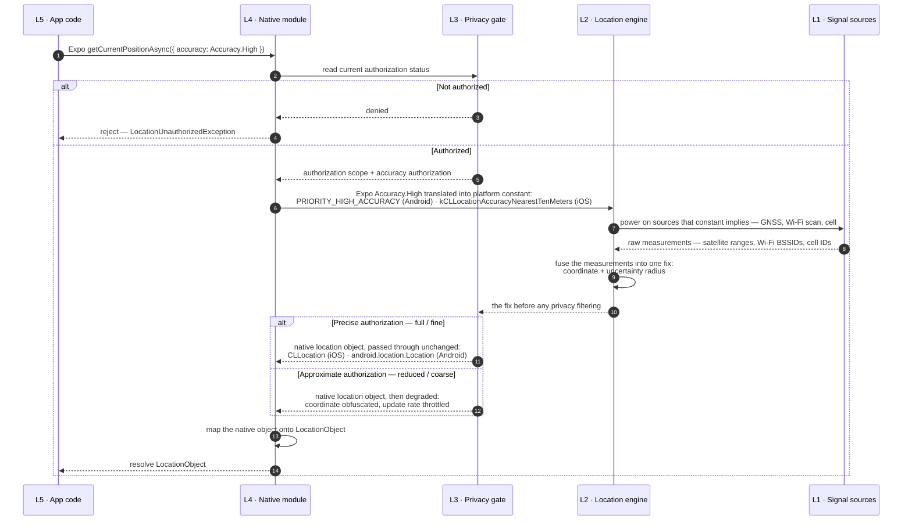
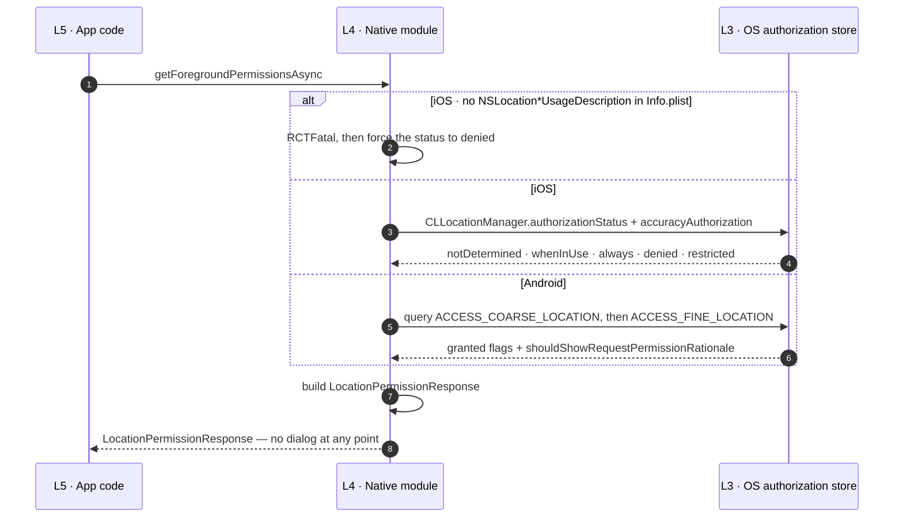
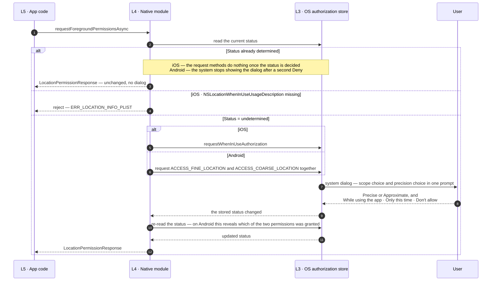
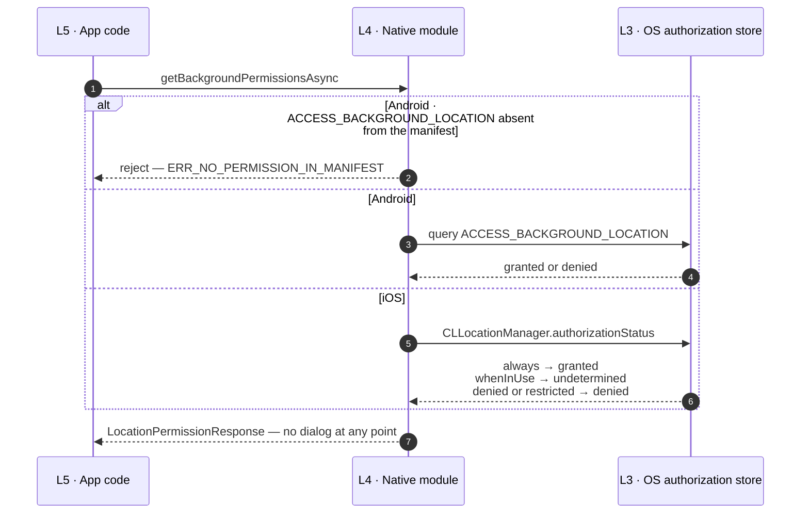
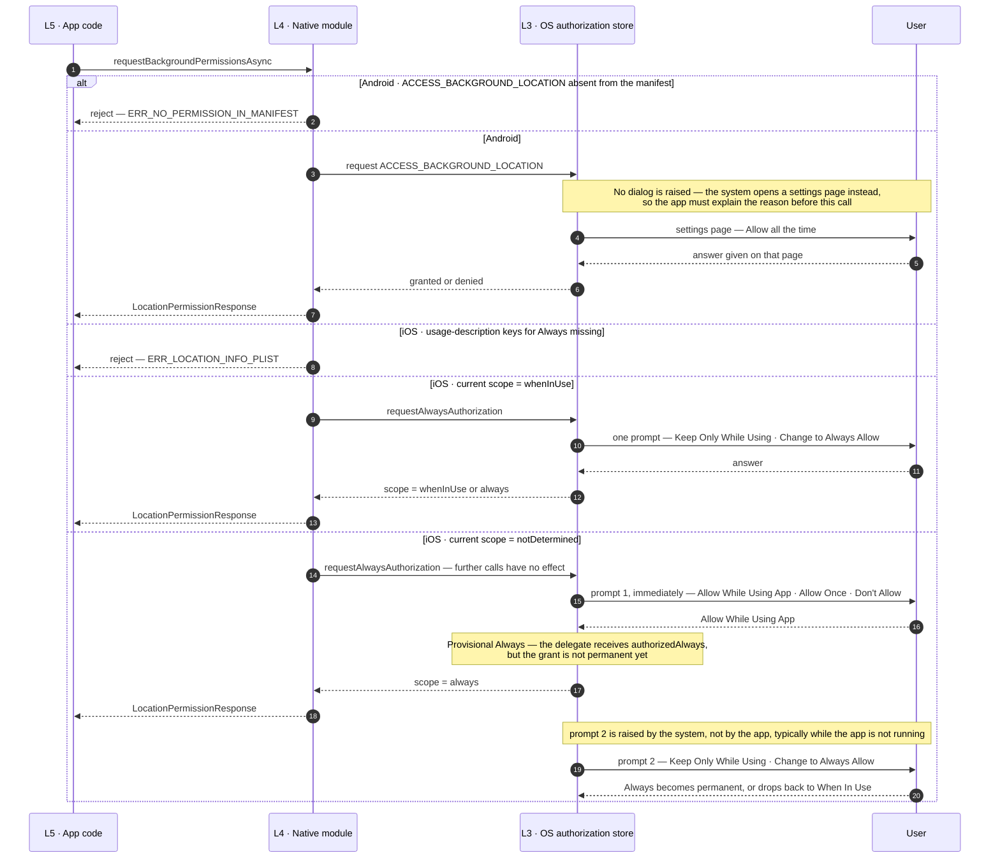
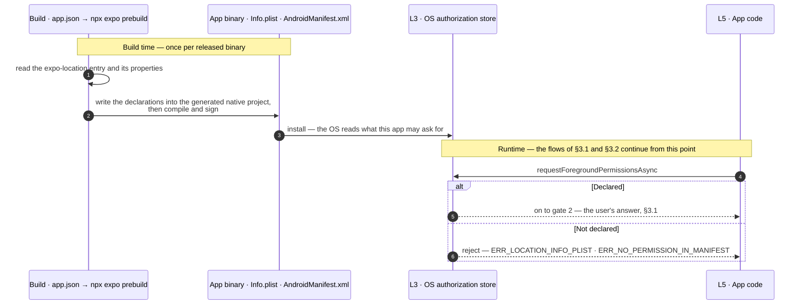

# Location Handling Flow — VinaUp Mobile

How location works in React Native / Expo, from the physical signal sources up to the JavaScript
API.

**Versions**:

| Package         | Version   |
| --------------- | --------- |
| `expo`          | `^57.0.0` |
| `expo-location` | `~57.0.6` |
| `react-native`  | `0.86.0`  |
| `react`         | `19.2.3`  |

---

<br/><br/>

## Table of contents

- [1 · Mental model](#1--mental-model)
  - [1.1 · How a coordinate is produced](#11--how-a-coordinate-is-produced)
  - [1.2 · Accuracy](#12--accuracy--the-uncertainty-attached-to-every-fix)
  - [1.3 · The location object](#13--the-location-object)
- [2 · Expo Location](#2--expo-location)
  - [2.1 · What it is and how it works](#21--what-it-is-and-how-it-works)
  - [2.2 · What `expo-location` does](#22--what-expo-location-does)
  - [2.3 · What `expo-location` does not do](#23--what-expo-location-does-not-do)
- [3 · Location authorization](#3--location-authorization)
  - [3.1 · Authorization scope](#31--authorization-scope)
  - [3.2 · Accuracy authorization — how precise the location may be](#32--accuracy-authorization--how-precise-the-location-may-be)
  - [3.3 · Build-time declarations](#33--build-time-declarations)
- [4 · References](#4--references)

---

<br/><br/>

## 1 · Mental model

A location request travels through **five layers**. Each layer has one job.

```
L5 · App code           expo-location JavaScript API — what we write
L4 · Native module      expo-location native side (Kotlin · Swift/ObjC) — the translator
L3 · Privacy gate       OS authorization: scope + accuracy authorization — the ceiling
L2 · Location engine    CoreLocation (iOS) · Fused Location Provider (Android) — computes the fix
L1 · Signal sources     GNSS satellites · Wi-Fi · cell towers · motion sensors — the raw input
```

A **fix** is one completed location measurement: the coordinate the engine solved for at a point in
time, together with its uncertainty radius. It is the classic positioning term (_position fix_), and
one fix is what becomes one `LocationObject`.

The sequence below is one full `getCurrentPositionAsync()` call across those five layers.



---

<br/>

### 1.1 · How a coordinate is produced

A **coordinate** is a pair of numbers identifying a point on the Earth's surface — **latitude** and
**longitude**, expressed in **degrees**, referenced to the **WGS 84** datum. Latitude runs from −90 to +90 (positive north of the equator), longitude from −180 to +180.

WGS 84 is the geodetic datum — the mathematical model of the Earth that the numbers are measured
against. GPS, CoreLocation (iOS) and Android all use it, so a coordinate taken from the device can be
stored and compared without any conversion.

The device **estimates** a coordinate from three kinds of input:

| Signal source                                               | How it yields a position                                                                                                                                                                                                                            | Typical error                                                                                                                           |
| ----------------------------------------------------------- | --------------------------------------------------------------------------------------------------------------------------------------------------------------------------------------------------------------------------------------------------- | --------------------------------------------------------------------------------------------------------------------------------------- |
| **GNSS** (GPS, GLONASS, Galileo)                            | Satellites broadcast their position and transmit time; the receiver derives distance from signal travel time and solves for its own position — **3 satellites minimum** for a 3D fix ([GPS.gov — Trilateration](https://www.gps.gov/trilateration)) | **≈ 4.9 m** in the open sky ([GPS.gov](https://www.gps.gov/gps-accuracy)); degrades near buildings, bridges and trees; unusable indoors |
| **Wi-Fi and cell towers**                                   | The device scans nearby access points and cell towers and looks their identifiers up in Apple's / Google's location database                                                                                                                        | Tens of metres to a few kilometres; works indoors, returns fast, costs little power                                                     |
| **Motion sensors** (accelerometer, gyroscope, magnetometer) | Produce no coordinate on their own; they supply heading and movement used to interpolate between fixes                                                                                                                                              | Smooths output; the origin of `heading` and `speed`                                                                                     |

The OS **fuses** them into **one fix** — a single `latitude`/`longitude` pair, one `accuracy` value
stating how far the real position may be from that pair, plus the accompanying `altitude`, `speed`,
`heading` and `timestamp`. Android names the mechanism:
_Fused Location Provider_.

The fix carries no indication of which source produced it. Two consecutive fixes can be solved from
different sources — one from GNSS, the next from Wi-Fi — which can cause reported `accuracy`
jump from 10 m to 500 m and back.

---

<br/>

### 1.2 · Accuracy

A coordinate is an estimate, so the device **cannot** claim the **exact location** — it claims the
user is **somewhere around** it. The word _accuracy_ appears in two places with two different meanings.

**`coords.accuracy` — the measured uncertainty, in metres.** Android defines it as _"the estimated
horizontal accuracy radius in meters of this location at the **68th percentile confidence level**"_
([`Location.getAccuracy()`](<https://developer.android.com/reference/android/location/Location#getAccuracy()>)).
Apple describes the same value as _"The radius of uncertainty for the location, measured in
meters… The location's latitude and longitude identify the center of the circle, and this value
indicates the radius of that circle."_
([`CLLocation.horizontalAccuracy`](https://developer.apple.com/documentation/corelocation/cllocation/horizontalaccuracy)).

```
coords.accuracy = 8      → 8 m radius     → precise enough to assert "inside the office"
coords.accuracy = 3000   → 3 km radius    → only good enough to assert "in this district"
```

**The `Accuracy` option — the Accuracy level the app asks for.** It is an enum passed into the API,
and what it actually controls is **which signal sources the OS powers up, how much battery it
spends, and how long it waits**.

The enum has **six** values ([Expo — `Accuracy`](https://docs.expo.dev/versions/latest/sdk/location/#accuracy)),
each translated at L4 into one platform constant:

| Option                          | Target accuracy — Expo docs                                                           | Android `Priority`                 | iOS `constant`                         |
| ------------------------------- | ------------------------------------------------------------------------------------- | ---------------------------------- | -------------------------------------- |
| `Accuracy.Lowest`               | Nearest three kilometers                                                              | `PRIORITY_LOW_POWER`               | `kCLLocationAccuracyThreeKilometers`   |
| `Accuracy.Low`                  | Nearest kilometer                                                                     | `PRIORITY_BALANCED_POWER_ACCURACY` | `kCLLocationAccuracyKilometer`         |
| `Accuracy.Balanced` _(default)_ | Within one hundred meters                                                             | `PRIORITY_BALANCED_POWER_ACCURACY` | `kCLLocationAccuracyHundredMeters`     |
| `Accuracy.High`                 | Within ten meters of the desired target                                               | `PRIORITY_HIGH_ACCURACY`           | `kCLLocationAccuracyNearestTenMeters`  |
| `Accuracy.Highest`              | The best level of accuracy available                                                  | `PRIORITY_HIGH_ACCURACY`           | `kCLLocationAccuracyBest`              |
| `Accuracy.BestForNavigation`    | Highest possible accuracy, using additional sensor data to facilitate navigation apps | `PRIORITY_HIGH_ACCURACY`           | `kCLLocationAccuracyBestForNavigation` |

**The option Accuracy is a request; `coords.accuracy` is the outcome.**

Three factors that may vary the outcome below the request: **environment** (indoors, underground), **time**, and **authorization**, see [§3.2](#32--accuracy-authorization--how-precise-the-location-may-be).

---

<br/>

### 1.3 · The location object

`LocationObject` is **Expo's own normalized shape** derived from the platform's native object.

**What the platforms return natively**

- **Android** returns [`android.location.Location`](https://developer.android.com/reference/android/location/Location)
- **iOS** returns [`CLLocation`](https://developer.apple.com/documentation/corelocation/cllocation)

**How `expo-location` maps them** (verified in `ios/LocationUtils.swift:22-35`,
`android/…/records/LocationResults.kt:103-155`):

| `LocationObject` field    | Android source                         | iOS source                        |
| ------------------------- | -------------------------------------- | --------------------------------- |
| `coords.latitude`         | `Location.getLatitude()`               | `CLLocation.coordinate.latitude`  |
| `coords.longitude`        | `Location.getLongitude()`              | `CLLocation.coordinate.longitude` |
| `coords.altitude`         | `Location.getAltitude()`               | `CLLocation.altitude`             |
| `coords.accuracy`         | `Location.getAccuracy()`               | `CLLocation.horizontalAccuracy`   |
| `coords.altitudeAccuracy` | `Location.getVerticalAccuracyMeters()` | `CLLocation.verticalAccuracy`     |
| `coords.heading`          | `Location.getBearing()`                | `CLLocation.course`               |
| `coords.speed`            | `Location.getSpeed()`                  | `CLLocation.speed`                |
| `timestamp`               | `Location.getTime()`                   | `CLLocation.timestamp` × 1000     |
| `mocked`                  | `Location.isFromMockProvider()`        | **not provided**                  |

**The resulting object**

```ts
type LocationObject = {
  coords: {
    latitude: number;
    longitude: number;
    altitude: number | null;
    accuracy: number | null;
    altitudeAccuracy: number | null;
    heading: number | null;
    speed: number | null;
  };
  timestamp: number;
  mocked?: boolean;
};
```

| Field              | Unit               | Meaning                                                                   | Notes                                                                                                                                                                       |
| ------------------ | ------------------ | ------------------------------------------------------------------------- | --------------------------------------------------------------------------------------------------------------------------------------------------------------------------- |
| `latitude`         | degrees, −90…+90   | Position north/south of the equator, WGS 84                               | Positive is north                                                                                                                                                           |
| `longitude`        | degrees, −180…+180 | Position east/west of the prime meridian, WGS 84                          | Positive is east                                                                                                                                                            |
| `altitude`         | metres             | Height of the device                                                      | **Datum differs per platform** — see the caveat below                                                                                                                       |
| `accuracy`         | metres             | Radius of the 68%-confidence circle around `latitude`/`longitude`         | The only quality signal available; validate against it                                                                                                                      |
| `altitudeAccuracy` | metres             | Uncertainty of `altitude`, also at 68% confidence                         | Apple: if this is `0` or negative, `altitude` is invalid                                                                                                                    |
| `heading`          | degrees, 0…360     | **Direction of travel**, clockwise from true north (0 = north, 90 = east) | Android calls it _bearing_ and states it is _"unrelated to the device orientation"_. For the direction the device is physically pointing, use `watchHeadingAsync()` instead |
| `speed`            | metres per second  | Instantaneous ground speed                                                | Apple: _"use this property for informational purposes only"_ — it changes between fixes                                                                                     |
| `timestamp`        | milliseconds       | Unix epoch time at which the fix was determined                           | Not the time the JS callback ran; a cached fix can be minutes old                                                                                                           |
| `mocked`           | boolean            | The fix came from a mock location provider                                | **Android only.** iOS exposes no equivalent through `expo-location`                                                                                                         |

**Two cross-platform caveats**

1. **`altitude` is not the same quantity on both platforms.** Android's `getAltitude()` is _"the
   altitude of this location in meters above the **WGS84 reference ellipsoid**"_, while iOS's
   `CLLocation.altitude` is _"the altitude above **mean sea level**"_ — an orthometric height. `expo-location` maps
   both to the single `coords.altitude` field, so the value is only comparable within one platform.
2. **iOS signals invalidity with negative numbers.** A negative `horizontalAccuracy` means latitude
   and longitude are invalid; a negative `course` or `speed` means that field is unavailable. Expo
   forwards those raw values, so JS can legitimately receive `heading: -1` or `speed: -1` on iOS.

---

<br/><br/>

## 2 · Expo Location

### 2.1 · What it is and how it works

`expo-location` is a **native module that acts as a translator** between the app's JavaScript and
the OS location engine. It contains no positioning algorithm of its own. It is L4 in
[§1](#1--mental-model).

It ships as **two halves** compiled into the app:

- **The JavaScript half** — the `.ts` files we import, declaring functions and types.
- **The native half** — Kotlin (`android/…/LocationModule.kt`) and Swift/Objective-C
  (`ios/LocationModule.swift`), which is what actually calls CoreLocation and the Fused Location
  Provider.

The two halves are connected through the **Expo Modules API**.

---

<br/>

### 2.2 · What `expo-location` does

Source: [Expo Location API reference](https://docs.expo.dev/versions/latest/sdk/location/).

| Capability                                 | API                                                                                                                                                                                      | Explanation                                                                                                                                                                                                                                                                                                                                                                                                                                                                                                              |
| ------------------------------------------ | ---------------------------------------------------------------------------------------------------------------------------------------------------------------------------------------- | ------------------------------------------------------------------------------------------------------------------------------------------------------------------------------------------------------------------------------------------------------------------------------------------------------------------------------------------------------------------------------------------------------------------------------------------------------------------------------------------------------------------------ |
| **Check device location services**         | `hasServicesEnabledAsync()` · `getProviderStatusAsync()` · `enableNetworkProviderAsync()` (Android)                                                                                      | Answers "is the phone's Location Services switch on", which is entirely separate from the app's authorization. With that switch off, an app holding every permission still gets nothing. `enableNetworkProviderAsync()` is Android-only and asks the user to _"turn on high accuracy location mode which enables network provider that uses Google Play services to improve location accuracy"_                                                                                                                          |
| **Foreground authorization**               | `requestForegroundPermissionsAsync()` · `getForegroundPermissionsAsync()` · `useForegroundPermissions()`                                                                                 | `request…` is the only call that raises the **foreground location** dialog; `get…` reads the current status **without prompting**. Both return a `LocationPermissionResponse`. The hook is the React-state wrapper around the same pair                                                                                                                                                                                                                                                                                  |
| **Background authorization**               | `requestBackgroundPermissionsAsync()` · `getBackgroundPermissionsAsync()` · `useBackgroundPermissions()`                                                                                 | Needed only when the app must read location while the user is not in the app. Foreground authorization must be granted first — _"your app can't obtain background permission without foreground permission"_. On Android the request raises **no dialog**: it _"will open the system settings page"_, so the app must explain the reason **before** calling it. Android additionally requires `ACCESS_BACKGROUND_LOCATION` in the manifest                                                                               |
| **Read a position — fresh fix**            | `getCurrentPositionAsync(options?)`                                                                                                                                                      | Forces the OS to produce a **new** fix. Most trustworthy, also the slowest. Indoors it can take seconds or fail. Use it when a coordinate must be trustworthy at the moment the user acts                                                                                                                                                                                                                                                                                                                                |
| **Read a position — cached fix**           | `getLastKnownPositionAsync(options?)`                                                                                                                                                    | Returns the last fix the OS already holds in memory — **near-instant, no battery cost** — at the price of possibly being stale. Two filters: `maxAge` (accept only fixes newer than N ms) and `requiredAccuracy` (accept only fixes with an uncertainty below N m). If neither is satisfied it returns `null` rather than a bad fix                                                                                                                                                                                      |
| **Observe position while the app is open** | `watchPositionAsync(options, callback, errorHandler?)` → `LocationSubscription`                                                                                                          | Delivers repeated fixes whenever the user moves far enough (`distanceInterval`, metres) or enough time passes (`timeInterval`, ms — **Android only**). Returns a subscription that **must be released with `.remove()`** when the screen unmounts, otherwise the sensors keep running                                                                                                                                                                                                                                    |
| **Observe position in the background**     | `startLocationUpdatesAsync(taskName, options?)` · `stopLocationUpdatesAsync(taskName)` · `hasStartedLocationUpdatesAsync(taskName)` · `isBackgroundLocationAvailableAsync()`             | Fixes are delivered into a background task, so `expo-task-manager` is **required** to define `taskName` at module scope. On Android the persistent notification (foreground service) appears **only when the `foregroundService` option is passed** — `shouldUseForegroundService()` merely tests whether that key is present (`android/…/taskConsumers/LocationTaskConsumer.kt:356`). `isBackgroundLocationAvailableAsync()` carries no Expo documentation; it returns `getProviderStatusAsync().backgroundModeEnabled` |
| **Geofencing**                             | `startGeofencingAsync(taskName, regions)` · `stopGeofencingAsync(taskName)` · `hasStartedGeofencingAsync(taskName)`                                                                      | Declares circular regions (`latitude`, `longitude`, `radius` in metres) and lets **the OS do the watching**; the app is woken on `Enter` / `Exit`. Cheaper than comparing distances inside `watchPositionAsync`. Hard limits: **100 regions per app on Android**, **20 simultaneous regions on iOS**                                                                                                                                                                                                                     |
| **Geocoding and reverse geocoding**        | `geocodeAsync(address)` → `LocationGeocodedLocation[]` · `reverseGeocodeAsync(coords)` → `LocationGeocodedAddress[]`                                                                     | `geocodeAsync` turns an address string into coordinates; `reverseGeocodeAsync` turns coordinates into a postal address (street, district, city…). Both use the **OS-provided geocoder**, not Google Places. **Android and iOS only**, and on Android _"you must request location permissions … before geocoding can be used"_. Expo calls them _"resource consuming"_ — _"creating too many requests at a time can result in an error"_                                                                                  |
| **Device heading (compass)**               | `getHeadingAsync()` · `watchHeadingAsync(callback)`                                                                                                                                      | Reports which way the device is **physically pointing** (`trueHeading` against geographic north, `magHeading` against magnetic north). Distinct from `coords.heading`, which is the direction of travel. `trueHeading` is `-1` without authorization                                                                                                                                                                                                                                                                     |
| **Motion activity recognition**            | `getMotionActivityAsync()` · `watchMotionActivityAsync(callback)` · `requestMotionActivityPermissionsAsync()` · `getMotionActivityPermissionsAsync()` · `useMotionActivityPermissions()` | A **separate permission** from location, requested with the motion-specific calls. The result is not a single activity: it holds **one entry per activity type** — `automotive` · `cycling` · `running` · `walking` · `stationary` · `unknown` — each `{ detected, confidence }` with confidence `Low` · `Medium` · `High`, so several can read `detected: true` at once                                                                                                                                                 |
| **Web geolocation interop**                | `installWebGeolocationPolyfill()`                                                                                                                                                        | _"Polyfills `navigator.geolocation` for interop with the core React Native and Web API approach"_ — code written against the browser `navigator.geolocation` API then runs unchanged                                                                                                                                                                                                                                                                                                                                     |

---

<br/>

### 2.3 · What `expo-location` does not do

| Not included                                                        | What it means in practice                                                                                                                                                                                  |
| ------------------------------------------------------------------- | ---------------------------------------------------------------------------------------------------------------------------------------------------------------------------------------------------------- |
| **Map UI**                                                          | No map view, no markers, no location picker screen. Rendering a position on a map needs a separate library such as `react-native-maps`                                                                     |
| **Address autocomplete and POI search**                             | `geocodeAsync` takes one complete address string and returns coordinates. It does not suggest addresses while typing and cannot find "cafés near me". That requires Google Places or an equivalent service |
| **Geometry**                                                        | No distance calculation between two coordinates, no point-in-polygon test. Implement it (Haversine) or pull in a geometry library                                                                          |
| **Forcing the user to grant permission or enable Precise Location** | No platform allows this, and it is not an Expo limitation. The app can only explain why it needs the data and open the system Settings screen                                                              |

---

<br/><br/>

## 3 · Location authorization

**Authorization is a status the operating system stores for each app.** The app can read it and can
ask for it; only the user can set it — by answering the system dialog, or later in Settings. It is
evaluated at **L3** ([§1](#1--mental-model)), so every location read passes through it. Apple:
_"the system prevents apps from using location data until they obtain authorization to do so. This
authorization process involves a one-time interruption… After the initial interruption, the system
stores your app's authorization status and doesn't prompt again."_

The stored status carries **two independent answers**:

| Axis                       | Question it answers                | Values                                                                                                                    |
| -------------------------- | ---------------------------------- | ------------------------------------------------------------------------------------------------------------------------- |
| **Authorization scope**    | _When_ may the app read location   | iOS `whenInUse`, `always` — Android foreground permissions, `ACCESS_BACKGROUND_LOCATION`                                  |
| **Accuracy authorization** | _How precise_ may that location be | iOS `full` · `reduced` — Android `fine` · `coarse` ([§3.2](#32--accuracy-authorization--how-precise-the-location-may-be)) |

**Scope levels.** `In-use` authorization covers the foreground. `Always` authorization additionally lets the system **launch a terminated app** to deliver significant-location-change, region-monitoring events.

**The app has exactly three operations.**

| Operation   | API                                                                                                   | Behaviour                                                                                                                                                                                                                                     |
| ----------- | ----------------------------------------------------------------------------------------------------- | --------------------------------------------------------------------------------------------------------------------------------------------------------------------------------------------------------------------------------------------- |
| **Read**    | `getForegroundPermissionsAsync()` · `getBackgroundPermissionsAsync()` · the `use…Permissions()` hooks | Returns the stored status. **Never prompts**                                                                                                                                                                                                  |
| **Request** | `requestForegroundPermissionsAsync()` · `requestBackgroundPermissionsAsync()`                         | Asks the OS to present its dialog. **A no-op once the status is determined** — Apple: _"If the initial authorization status is anything other than `notDetermined`, this method does nothing"_; `expo-location` short-circuits those requests |
| **Consume** | `getCurrentPositionAsync()` · `watchPositionAsync()` · the background task APIs                       | Reads the status first and **rejects** when it is insufficient. **Never prompts**                                                                                                                                                             |

**The dialog appears only where the app calls Request.** A read call on an unauthorized app produces an error, never a prompt.

---

<br/>

### 3.1 · Authorization scope

#### Flow — reading foreground authorization

`getForegroundPermissionsAsync()` only inspects what the OS already stores.



#### Flow — requesting foreground authorization

`requestForegroundPermissionsAsync()` is the only call that can put a dialog on screen, and only
while the status is still `undetermined`.



#### Flow — reading background authorization

`getBackgroundPermissionsAsync()` inspects the second scope level.



#### Flow — requesting background authorization

`requestBackgroundPermissionsAsync()` escalates an existing foreground grant.



**The permission response object.** `LocationPermissionResponse` is **Expo's normalized shape for the stored authorization status**. It
is the `PermissionResponse` type exported by `expo-modules-core`, extended with one platform-specific
sub-object per platform.

```ts
type LocationPermissionResponse = {
  status: 'granted' | 'denied' | 'undetermined';
  granted: boolean;
  canAskAgain: boolean;
  expires: 'never' | number;

  ios?: { scope: 'whenInUse' | 'always' | 'none'; accuracy: 'full' | 'reduced' };
  android?: { accuracy: 'fine' | 'coarse' | 'none' };
};
```

**Where each field comes from**

| Field              | Android                                         | iOS                                       |
| ------------------ | ----------------------------------------------- | ----------------------------------------- |
| `status`           | Runtime permission state                        | `CLAuthorizationStatus`                   |
| `granted`          | `status === 'granted'`                          | `status === 'granted'`                    |
| `canAskAgain`      | `shouldShowRequestPermissionRationale`          | `status != denied`                        |
| `expires`          | Hard-coded `'never'`                            | Hard-coded `'never'`                      |
| `android.accuracy` | Which of the `FINE` / `COARSE` pair was granted | —                                         |
| `ios.scope`        | —                                               | `CLAuthorizationStatus`                   |
| `ios.accuracy`     | —                                               | `CLLocationManager.accuracyAuthorization` |

**What each field means**

| Field              | Meaning                                                                                                                                                                  |
| ------------------ | ------------------------------------------------------------------------------------------------------------------------------------------------------------------------ |
| `status`           | `undetermined` — never asked, a Request will show the dialog. `granted` — location may be read. `denied` — refused by the user, or forced by a missing `Info.plist` key  |
| `granted`          | Convenience for `status === 'granted'`. **It answers the scope axis only** — a granted app can still be limited to approximate location                                  |
| `canAskAgain`      | Whether a Request can still produce a dialog. `false` → the system Settings screen is the only remaining route                                                           |
| `expires`          | Always `'never'` on both platforms — _"Currently, all permissions are granted permanently"_                                                                              |
| `ios.scope`        | `whenInUse` · `always` · `none`. **"Allow Once" also reports `whenInUse`** — iOS gives the app no way to tell the two apart                                              |
| `ios.accuracy`     | `full` · `reduced`. Read it only together with `status === 'granted'`, because the underlying `accuracyAuthorization` defaults to full accuracy before any answer exists |
| `android.accuracy` | `fine` · `coarse` · `none`. This single field collapses both axes: `none` means no location permission at all, `coarse`/`fine` express the accuracy axis                 |

**Missing authorization is a rejected promise.** The native side throws a coded exception, which
surfaces in JavaScript as a **rejected promise**. Error codes are derived from the exception class
name, `ERR_` + `SNAKE_CASE`.

| Condition                                              | Platform | Error code                                  | Message                                                                                                   |
| ------------------------------------------------------ | -------- | ------------------------------------------- | --------------------------------------------------------------------------------------------------------- |
| Foreground authorization missing                       | iOS      | `ERR_DENIED_FOREGROUND_LOCATION_PERMISSION` | Location permission is required to do this operation                                                      |
| Foreground authorization missing                       | Android  | `ERR_LOCATION_UNAUTHORIZED`                 | Not authorized to use location services                                                                   |
| Background authorization missing                       | iOS      | `ERR_DENIED_BACKGROUND_LOCATION_PERMISSION` | Background location permission is required to do this operation                                           |
| Background authorization missing                       | Android  | `ERR_LOCATION_BACKGROUND_UNAUTHORIZED`      | Not authorized to use background location services                                                        |
| Device Location Services switched off                  | iOS      | `ERR_LOCATION_SERVICES_DISABLED`            | Location services are disabled                                                                            |
| Device Location Services switched off                  | Android  | `ERR_CURRENT_LOCATION_IS_UNAVAILABLE`       | Current location is unavailable. Make sure that location services are enabled                             |
| `Info.plist` usage-description key missing             | iOS      | `ERR_LOCATION_INFO_PLIST`                   | The `NSLocationWhenInUseUsageDescription` key must be present in Info.plist to be able to use geolocation |
| `ACCESS_BACKGROUND_LOCATION` missing from the manifest | Android  | `ERR_NO_PERMISSION_IN_MANIFEST`             | You need to add `ACCESS_BACKGROUND_LOCATION` to the AndroidManifest                                       |

**Approximate location produces no error at all** — it resolves normally with a degraded coordinate
([§3.2](#32--accuracy-authorization--how-precise-the-location-may-be)).

**A Request can only ask for what the binary declared** — the build-time half of authorization,
covered in [§3.3](#33--build-time-declarations).

---

<br/>

### 3.2 · Accuracy authorization — how precise the location may be

It is the _"share location"_ versus _"share location + precise location"_ distinction.

| Platform    | User choice     | Reported as                                                  |
| ----------- | --------------- | ------------------------------------------------------------ |
| **iOS**     | Precise **on**  | `ios.accuracy: 'full'`                                       |
| **iOS**     | Precise **off** | `ios.accuracy: 'reduced'`                                    |
| **Android** | Precise         | `ACCESS_FINE_LOCATION` granted → `android.accuracy: 'fine'`  |
| **Android** | Approximate     | `ACCESS_COARSE_LOCATION` only → `android.accuracy: 'coarse'` |

**Approximate location is a deliberate degradation.** The engine computes the precise fix first, then
the privacy gate damages it along two dimensions before handing it over:

- **Obfuscation** — space.
  iOS picks it by _"selecting a nearby point of interest"_, leaving it _"usually within 1–20
  kilometers of the actual location"_
  ([`kCLLocationAccuracyReduced`](https://developer.apple.com/documentation/corelocation/kcllocationaccuracyreduced)).
  Android: _"locations that have been obfuscated to hide the device's exact location"_
  ([`FusedLocationProviderClient`](https://developers.google.com/android/reference/com/google/android/gms/location/FusedLocationProviderClient)).
- **Throttling** — time. A fresh fix arrives less often. iOS: _"updating the location at most a few
  times per hour"_
  ([`kCLLocationAccuracyReduced`](https://developer.apple.com/documentation/corelocation/kcllocationaccuracyreduced)).
  Android: _"location updates at a throttled rate"_
  ([`FusedLocationProviderClient`](https://developers.google.com/android/reference/com/google/android/gms/location/FusedLocationProviderClient)).

**The user's settings overrides the app's request, silently** — no exception, no
warning, no user-visible notice. The `Accuracy` option
([§1.2](#12--accuracy--the-uncertainty-attached-to-every-fix)) is capped at this ceiling:

- iOS: _"If the value is CLAccuracyAuthorization.reducedAccuracy, setting desiredAccuracy to a value other than kCLLocationAccuracyReduced has no effect on the location information"_
  ([`accuracyAuthorization`](https://developer.apple.com/documentation/corelocation/cllocationmanager/accuracyauthorization)).
- Android: _"If the user grants the approximate location permission, your app only has access to approximate location, regardless of which location permissions your app declares."_
  ([Request location permissions](https://developer.android.com/develop/sensors-and-location/location/permissions)).

Requesting `Accuracy.BestForNavigation` under approximate authorization therefore spends the battery
of a high-accuracy fix and still returns a kilometre-scale coordinate. The only signal the app ever
receives is `coords.accuracy`.

Two further consequences on this axis:

1. **The choice carries into the background.** Android: _"If the user grants your app the
   `ACCESS_BACKGROUND_LOCATION` permission but grants only approximate location access in the
   foreground, your app has only approximate location access in the background as well"_
   ([Request background location](https://developer.android.com/develop/sensors-and-location/location/permissions/background)).
2. **`ACCESS_FINE_LOCATION` must be requested together with `ACCESS_COARSE_LOCATION`** — requesting
   the fine permission on its own can be ignored by the system
   ([Request location permissions at runtime](https://developer.android.com/develop/sensors-and-location/location/permissions/runtime)),
   and _"the user may force any app to use coarse location even if it has requested fine location"_
   ([`Granularity`](https://developers.google.com/android/reference/com/google/android/gms/location/Granularity)).
   `requestForegroundPermissionsAsync()` already requests the pair.

---

<br/>

### 3.3 · Build-time declarations

**A build-time declaration is a static entry inside the app bundle naming an authorization the app is
allowed to request**. The operating system reads it out of the installed app, and no line of
JavaScript can add to it or change it.

It carries three roles.

1. **Ceiling.** Every grant the app can ever hold is a subset of what the binary declared, and a
   Request for an undeclared authorization fails before any dialog is considered — Apple:
   _"Authorization requests fail immediately if the required keys aren't present."_
   ([Requesting authorization to use location services](https://developer.apple.com/documentation/corelocation/requesting-authorization-to-use-location-services))
2. **Dialog content.** On iOS the declaration is the sentence the alert displays — _"The alert
   includes a usage description string that explains why you want access to location data. You
   provide this string in your app's Information Property List."_
3. **Public statement.** The stores and the device Settings screen enumerate what the app may ask
   for — Android: _"These declarations help app stores and users understand the set of permissions
   that your app might request."_
   ([Declare app permissions](https://developer.android.com/training/permissions/declaring))

| What the app needs to do                            | iOS — `Info.plist`                             | Android — `AndroidManifest.xml`                      |
| --------------------------------------------------- | ---------------------------------------------- | ---------------------------------------------------- |
| Read location while the app is in use               | `NSLocationWhenInUseUsageDescription`          | `ACCESS_FINE_LOCATION` · `ACCESS_COARSE_LOCATION`    |
| Read location at all times                          | `NSLocationAlwaysAndWhenInUseUsageDescription` | `ACCESS_BACKGROUND_LOCATION`                         |
| Keep receiving updates while the app is not visible | `UIBackgroundModes: location`                  | `FOREGROUND_SERVICE` · `FOREGROUND_SERVICE_LOCATION` |

A missing declaration surfaces as one of the errors in [§3.1](#31--authorization-scope):
`ERR_LOCATION_INFO_PLIST` on iOS, `ERR_NO_PERMISSION_IN_MANIFEST` on Android.

#### Flow — from build config to the first runtime call

Everything below happens **before** any API in [§3.1](#31--authorization-scope) runs.



Because step 3 reads a signed binary, a declaration **cannot be corrected by an over-the-air
JavaScript update**: the config plugin sets _"properties that cannot be set at runtime and require
building a new app binary to take effect"_
([Expo Location](https://docs.expo.dev/versions/latest/sdk/location/)).

#### Where the declarations come from

`Info.plist` and `AndroidManifest.xml` are never edited by hand. `expo-location` supplies the
declarations through **two mechanisms**.

1. **Its own Android manifest.** The package ships
   `expo-location/android/src/main/AndroidManifest.xml`, which already declares
   `ACCESS_FINE_LOCATION` and `ACCESS_COARSE_LOCATION`. Gradle merges every library manifest into the
   app manifest at build time, so those two permissions arrive **with no app-side configuration at
   all** ([Merge multiple manifest files](https://developer.android.com/build/manage-manifests)).
2. **Its config plugin.** `npx expo prebuild` reads the `expo-location` entry in `app.json` and
   writes the iOS keys — plus the optional Android permissions, when asked for — into the generated
   projects. The iOS usage-description keys are written **whenever the plugin is listed at all**,
   filled with default English text.

```jsonc
// app.json → expo.plugins
[
  "expo-location",
  { "locationWhenInUsePermission": "<one sentence stating why this app reads location>" },
]
```

---

<br/><br/>

## 4 · References

### Expo

| Source                                 | URL                                                                        |
| -------------------------------------- | -------------------------------------------------------------------------- |
| Expo Location — API reference (SDK 57) | https://docs.expo.dev/versions/latest/sdk/location/                        |
| Expo SDK 57 changelog                  | https://expo.dev/changelog/sdk-57                                          |
| `expo-location` CHANGELOG              | https://github.com/expo/expo/blob/main/packages/expo-location/CHANGELOG.md |
| Continuous Native Generation (CNG)     | https://docs.expo.dev/workflow/continuous-native-generation/               |
| Config plugins                         | https://docs.expo.dev/config-plugins/introduction/                         |

---

<br/>

### GNSS / GPS

| Source                                                           | URL                               |
| ---------------------------------------------------------------- | --------------------------------- |
| GPS.gov — Trilateration                                          | https://www.gps.gov/trilateration |
| GPS.gov — GPS Accuracy (≈ 4.9 m for smartphones in the open sky) | https://www.gps.gov/gps-accuracy  |

---

<br/>

### Apple — Core Location

| Source                                                                  | URL                                                                                                                                            |
| ----------------------------------------------------------------------- | ---------------------------------------------------------------------------------------------------------------------------------------------- |
| Requesting authorization to use location services                       | https://developer.apple.com/documentation/corelocation/requesting-authorization-to-use-location-services                                       |
| `CLLocationManager.requestWhenInUseAuthorization()`                     | https://developer.apple.com/documentation/corelocation/cllocationmanager/requestwheninuseauthorization()                                       |
| `CLLocationManager.requestAlwaysAuthorization()` — provisional always   | https://developer.apple.com/documentation/corelocation/cllocationmanager/requestalwaysauthorization()                                          |
| `CLLocation`                                                            | https://developer.apple.com/documentation/corelocation/cllocation                                                                              |
| `CLLocationCoordinate2D` (WGS 84)                                       | https://developer.apple.com/documentation/corelocation/cllocationcoordinate2d                                                                  |
| `CLLocation.altitude` · `ellipsoidalAltitude`                           | https://developer.apple.com/documentation/corelocation/cllocation/altitude                                                                     |
| `CLLocation.horizontalAccuracy` · `verticalAccuracy`                    | https://developer.apple.com/documentation/corelocation/cllocation/horizontalaccuracy                                                           |
| `CLLocation.course` · `speed`                                           | https://developer.apple.com/documentation/corelocation/cllocation/course                                                                       |
| `CLLocationManager.accuracyAuthorization`                               | https://developer.apple.com/documentation/corelocation/cllocationmanager/accuracyauthorization                                                 |
| `CLLocationManager.desiredAccuracy`                                     | https://developer.apple.com/documentation/corelocation/cllocationmanager/desiredaccuracy                                                       |
| `kCLLocationAccuracyReduced`                                            | https://developer.apple.com/documentation/corelocation/kcllocationaccuracyreduced                                                              |
| `requestTemporaryFullAccuracyAuthorization(withPurposeKey:completion:)` | https://developer.apple.com/documentation/corelocation/cllocationmanager/requesttemporaryfullaccuracyauthorization(withpurposekey:completion:) |
| `NSLocationDefaultAccuracyReduced`                                      | https://developer.apple.com/documentation/bundleresources/information-property-list/nslocationdefaultaccuracyreduced                           |
| `NSLocationTemporaryUsageDescriptionDictionary`                         | https://developer.apple.com/documentation/bundleresources/information-property-list/nslocationtemporaryusagedescriptiondictionary              |
| `NSLocationWhenInUseUsageDescription`                                   | https://developer.apple.com/documentation/bundleresources/information-property-list/nslocationwheninuseusagedescription                        |
| `NSLocationAlwaysAndWhenInUseUsageDescription`                          | https://developer.apple.com/documentation/bundleresources/information-property-list/nslocationalwaysandwheninuseusagedescription               |
| `UIBackgroundModes`                                                     | https://developer.apple.com/documentation/bundleresources/information-property-list/uibackgroundmodes                                          |

---

<br/>

### Android / Google Play services

| Source                                                                         | URL                                                                                                         |
| ------------------------------------------------------------------------------ | ----------------------------------------------------------------------------------------------------------- |
| `android.location.Location`                                                    | https://developer.android.com/reference/android/location/Location                                           |
| Request location permissions                                                   | https://developer.android.com/develop/sensors-and-location/location/permissions                             |
| Request location permissions at runtime                                        | https://developer.android.com/develop/sensors-and-location/location/permissions/runtime                     |
| Request runtime permissions (one-time permission, asking in context)           | https://developer.android.com/training/permissions/requesting                                               |
| Request background location                                                    | https://developer.android.com/develop/sensors-and-location/location/permissions/background                  |
| Declare app permissions                                                        | https://developer.android.com/training/permissions/declaring                                                |
| Merge multiple manifest files                                                  | https://developer.android.com/build/manage-manifests                                                        |
| Change location settings (`Priority` constants)                                | https://developer.android.com/develop/sensors-and-location/location/change-location-settings                |
| `FusedLocationProviderClient` (obfuscation and throttling)                     | https://developers.google.com/android/reference/com/google/android/gms/location/FusedLocationProviderClient |
| `Granularity`                                                                  | https://developers.google.com/android/reference/com/google/android/gms/location/Granularity                 |
| Foreground service types (`location`, `FOREGROUND_SERVICE_LOCATION`)           | https://developer.android.com/develop/background-work/services/fgs/service-types                            |
| Android Developers Blog — Redefining Location Privacy (Android 17, 2026-03-26) | https://android-developers.googleblog.com/2026/03/location-privacy.html                                     |
