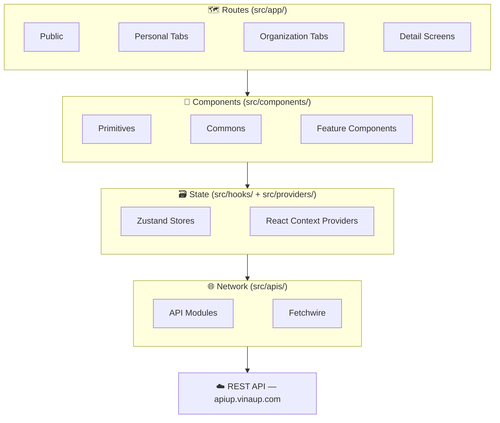
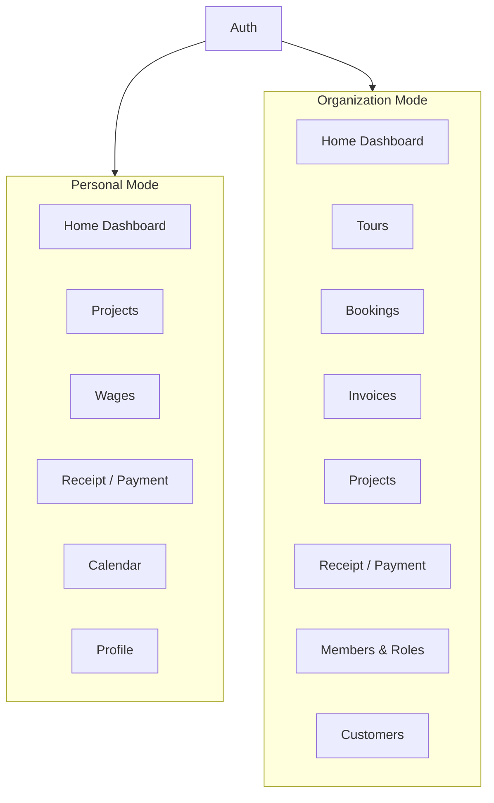

# Component Diagram

## High-Level

Data flows top-to-bottom; user interactions bubble upward.

---

## Features

---

## Directories

| Directory | Role |
|-----------|------|
| `src/app/` | File-based routing via Expo Router — public screens, personal tabs, organization tabs, and detail routes |
| `src/apis/` | Named API functions organized by business domain, built on Fetchwire — one folder per domain, split into sub-files for complex domains |
| `src/components/` | UI component library — primitives, cross-feature commons, and domain-scoped feature components |
| `src/providers/` | React Context providers — server-derived state and UI action handlers, organized into `auth/`, `commons/`, `organization/`, `personal/` |
| `src/hooks/` | Zustand stores for ephemeral and persisted UI state |
| `src/interfaces/` | TypeScript request/response types and query-param types, one file per domain |
| `src/constants/` | App-wide constants (date formats, storage keys, colors, layout) and domain-specific enums and option lists |
| `src/utils/calculator/` | Business calculation helpers — pure functions, no external dependencies |
| `src/utils/generator/string-generator/` | String formatting utilities — pure functions, no external dependencies |
| `src/utils/generator/file-generator/html/` | HTML template generators — pure functions, no external dependencies |
| `src/utils/generator/file-generator/pdf/` | PDF creation and sharing — uses Expo file system APIs |
| `src/utils/generator/file-generator/excel/` | Excel export — placeholder (`.gitkeep` only) |

### `src/components/` — sub-folders

| Sub-folder | Contents |
|---|---|
| `auth/` | Login and Register screen content |
| `commons/` | Cross-feature shared components — headers, modals, cards, bars, skeletons, signature canvas, selectors, grids, receipt-payment controls, shared screen-contents |
| `icons/` | 40+ custom SVG icon components (`.native.tsx`) |
| `organization/` | Organization feature components — booking, invoice, project, tour (each with `list/`, `detail/`, `modals/`, `screen-contents/` sub-folders) |
| `personal/` | Personal feature components — project, wage, calendar (each with `list/`, `detail/`, `modals/` sub-folders) |
| `primitives/` | Base UI atoms — buttons, inputs, selects, pickers, sheet, skeleton, loader, tabs, error boundary |

### `src/apis/` — sub-folders

| Sub-folder | Contents |
|---|---|
| `auth/` | Login, register |
| `booking/` | Booking CRUD |
| `category/` | Project categories and receipt-payment categories |
| `invoice/` | Invoice CRUD |
| `organization/` | Organization, members, customers, roles |
| `project/` | Project CRUD |
| `receipt-payment/` | Receipt and payment transaction CRUD |
| `signature/` | Digital signature workflow (sign, cancel, manage receivers) |
| `social-link/` | Social link management |
| `tour/` | Tour CRUD; tour calculation, implementation, and settlement sub-resources |
| `upload/` | File upload |
| `user/` | User profile and search |
| `wage/` | Wage CRUD |

---

> See [SYSTEM-CONTEXT-DIAGRAM.md](./SYSTEM-CONTEXT-DIAGRAM.md) for the system boundary and [SCREEN-FLOW-DIAGRAM.md](./SCREEN-FLOW-DIAGRAM.md) for how the screens connect.