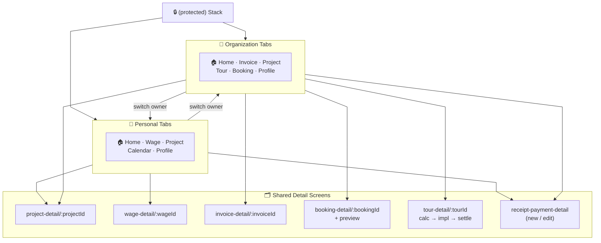
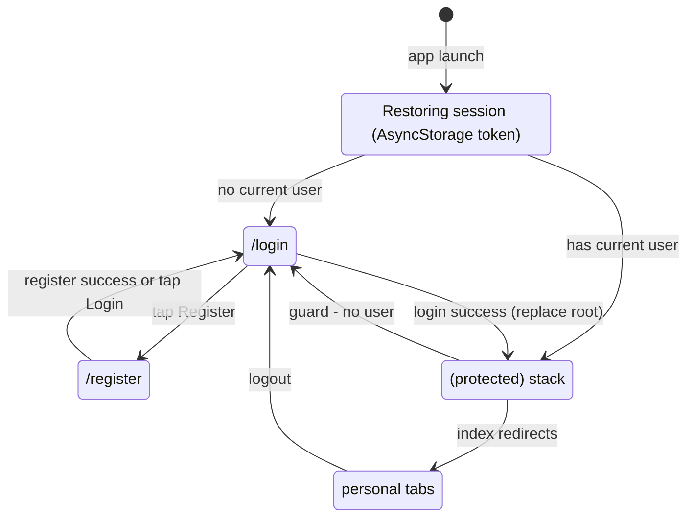
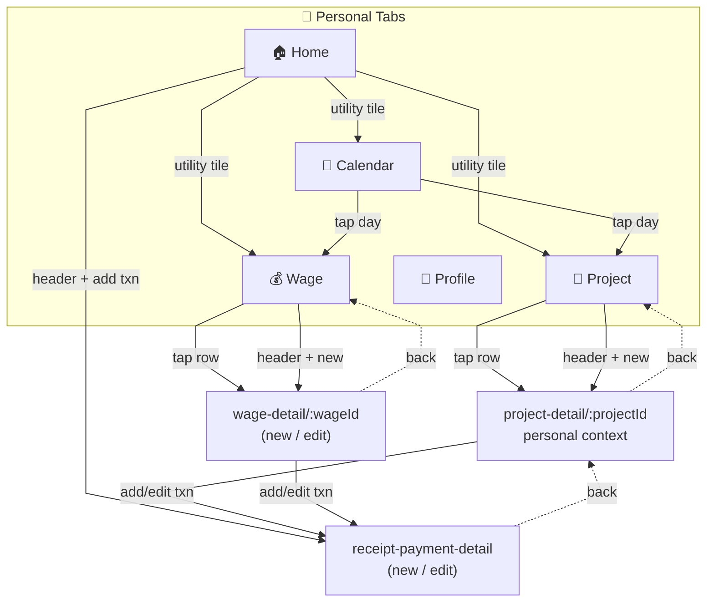
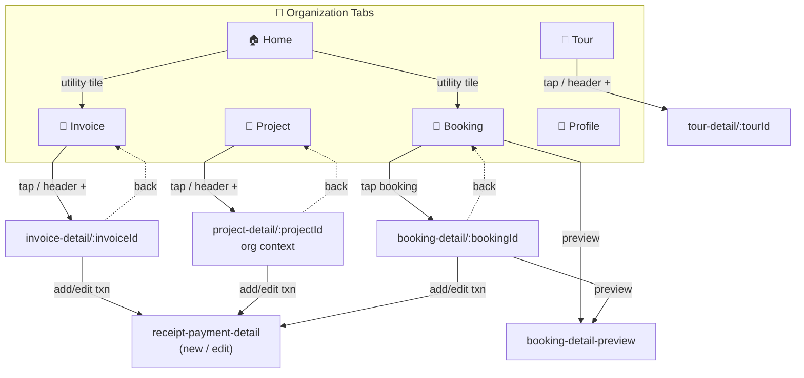
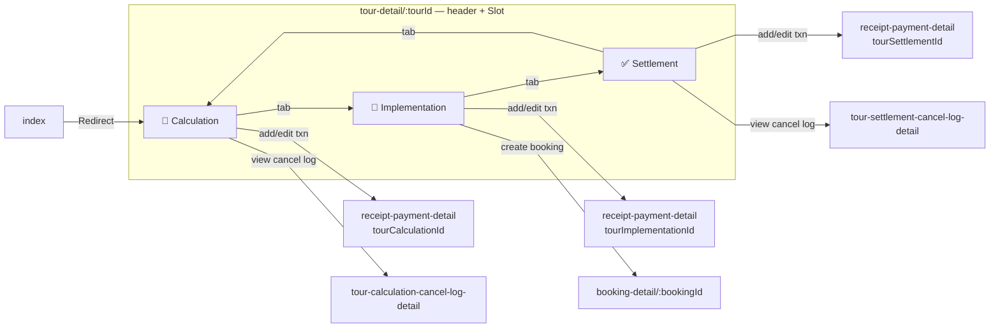
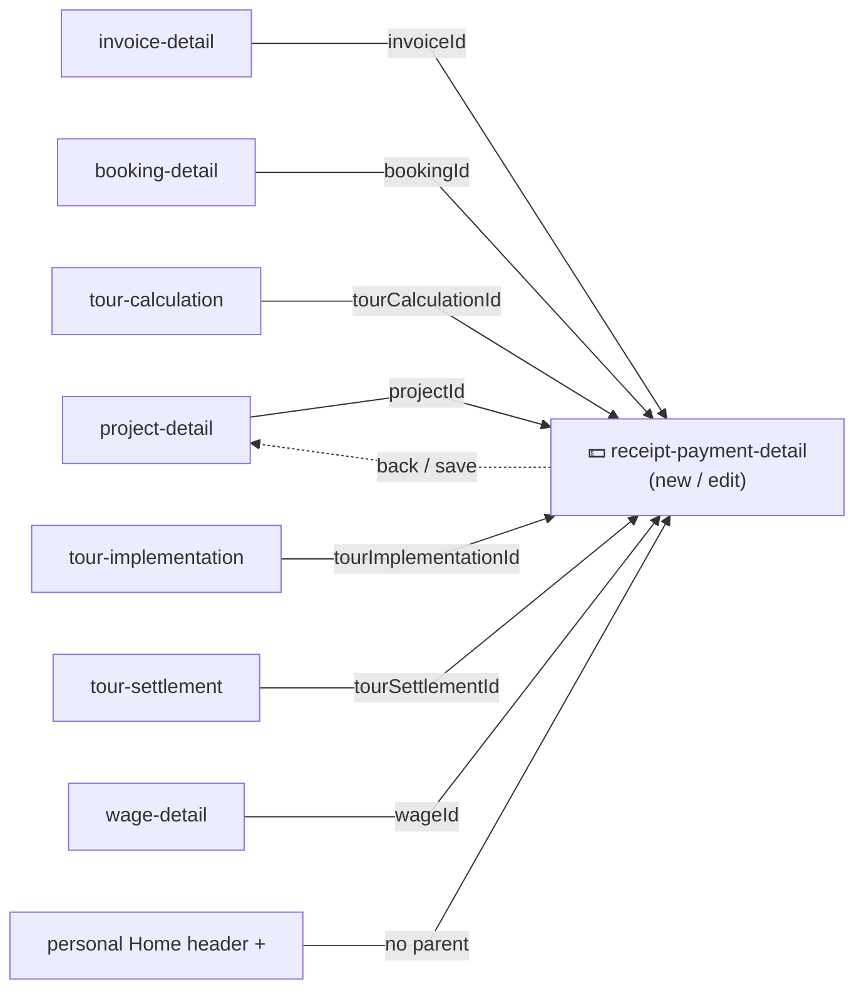

# Screen Flow Diagram

How the app's screens connect and what each screen contains. Navigation is **file-based** (Expo Router v55) — routes are defined by the file tree under `src/app/`, and screen bodies live in `src/components/**/screen-contents/`.

Every edge in the diagrams below is traced from a real navigation call in the code (`router.push` / `router.replace` / `router.navigate` / `<Redirect>`); the originating file is named in the per-section notes and in the [Navigation Edge Index](#navigation-edge-index).

---

## 1. Top-level Navigation Map

The big picture.

**Mode switching** — the owner selector in the header replaces the whole tab stack:

| Action | Call | File |
|---|---|---|
| Switch to personal | `router.replace('/personal')` | [owner-selector.tsx](../../src/components/commons/selectors/owner-selector/owner-selector.tsx#L73) |
| Switch to an organization | `router.replace('/organization/${orgId}')` | [owner-selector.tsx](../../src/components/commons/selectors/owner-selector/owner-selector.tsx#L79) |
| Personal navigator selector | `router.navigate(path)` | [personal-navigator-selector.tsx](../../src/components/commons/selectors/navigator-selector/personal-navigator-selector.tsx) |
| Organization navigator selector (Invoice / Project / Tour / Booking) | `router.navigate(path)` | [organization-navigator-selector.tsx](../../src/components/commons/selectors/navigator-selector/organization-navigator-selector.tsx) |

---

## 2. Root & Auth Flow

The splash screen stays up; afterwards the user is routed to the auth screens or into the protected area.

**Source files**

| Behaviour | File |
|---|---|
| Root stack + `AuthProvider` mount | [src/app/_layout.tsx](../../src/app/_layout.tsx) |
| Session restore, `performLogin` / `performLogout` | [src/providers/auth/auth-provider.tsx](../../src/providers/auth/auth-provider.tsx) |
| Auth guard `Redirect href="/login"` | [src/app/(protected)/_layout.tsx](../../src/app/(protected)/_layout.tsx#L26-L28) |
| Protected index `Redirect → personal/(tabs)` | [src/app/(protected)/index.tsx](../../src/app/(protected)/index.tsx#L4) |
| Login `replace('/')` (success), `replace('/register')` (footer) | [login-screen-content.tsx](../../src/components/auth/screen-contents/login-screen-content.tsx#L30) |
| Register `replace('/login')` (success + footer) | [register-screen-content.tsx](../../src/components/auth/screen-contents/register-screen-content.tsx#L33) |
| Logout from profile tabs | [personal-profile-screen-content.tsx](../../src/components/personal/screen-contents/personal-profile-screen-content.tsx#L12) · [organization-profile-screen-content.tsx](../../src/components/organization/screen-contents/organization-profile-screen-content.tsx#L16) |

---

## 3. Personal Mode Flow

5 tabs.

**Key sources:** [personal-home-index-summary.tsx](../../src/components/personal/home/personal-home-index-summary.tsx#L35) · [personal-index-screen-content.tsx](../../src/components/personal/screen-contents/personal-index-screen-content.tsx#L68) · [personal-wage-list-section.tsx](../../src/components/personal/wage/list/personal-wage-list-section.tsx#L35) · [personal-project-list-section.tsx](../../src/components/personal/project/list/personal-project-list-section.tsx#L38) · [project-calendar.tsx](../../src/components/personal/calendar/project-calendar.tsx) · [wage-calendar.tsx](../../src/components/personal/calendar/wage-calendar.tsx) · header bottoms under [home-header/](../../src/components/commons/headers/home-header/).

---

## 4. Organization Mode Flow

6 tabs, scoped by `[organizationId]`.

**Key sources:** [organization-home-index-summary.tsx](../../src/components/organization/home/organization-home-index-summary.tsx#L30) · [organization-index-screen-content.tsx](../../src/components/organization/screen-contents/organization-index-screen-content.tsx#L63) · [invoice-card.tsx](../../src/components/organization/invoice/invoice-card.tsx#L40) · [organization-project-list-section.tsx](../../src/components/organization/project/list/organization-project-list-section.tsx#L40) · [organization-tour-list-section.tsx](../../src/components/organization/tour/list/organization-tour-list-section.tsx#L29) · [booking-card.tsx](../../src/components/organization/booking/booking-card.tsx#L44-L54).

---

## 5. Tour Detail Sub-Flow

A mini-app: a custom header (status selector, delete, save) wraps three sequential stages rendered via `<Slot>`.

**Key sources:** [tour-detail/[tourId]/_layout.tsx](../../src/app/(protected)/tour-detail/[tourId]/_layout.tsx) (header, delete/save `router.back()`) · [tour-detail/[tourId]/index.tsx](../../src/app/(protected)/tour-detail/[tourId]/index.tsx#L8) (redirect) · [organization-tour-detail-tab-list.tsx](../../src/components/organization/tour/detail/organization-tour-detail-tab-list.tsx#L19) (stage switch via `router.replace`) · [booking-tour-implementation-tab-panel.tsx](../../src/components/organization/tour/tour-implementation/tab-panels/booking-tour-implementation-tab-panel.tsx#L52) · cancel-log modals under [tour-calculation/modals/](../../src/components/organization/tour/tour-calculation/modals/) and [tour-settlement/modals/](../../src/components/organization/tour/tour-settlement/modals/).

---

## 6. Receipt / Payment — Cross-Context Hub

A **single shared form** reachable from seven parents. The parent's id is passed as a param.

**Source:** the param → invalidation-tag switch lives in [receipt-payment-detail/[receiptPaymentId].tsx](../../src/app/(protected)/receipt-payment-detail/[receiptPaymentId].tsx). Entry points: `receipt-payment-list-in-*` components under [commons/receipt-payment/](../../src/components/commons/receipt-payment/), [booking/](../../src/components/organization/booking/), and the tour `sections/` folders.

---

## 7. Per-Screen Reference

Each screen is a thin route file under `src/app/` that mounts its providers and delegates the body to a `*-screen-content` component.

Column conventions:

- **Key UI** — the visible elements on the screen, written as nouns (e.g. _list_, _button_, _grid_). A scrollable collection of records is always called a _list_, regardless of whether each item renders as a card or a row.
- **User actions** — what the user can do, one action per line, each phrased as an imperative verb (e.g. _Tap a wage_, _Save_). Destinations are not repeated here — they live in _Navigates to_.
- **Navigates to** — the routes a screen leads to; `back` means `router.back()`.

### Auth

| Screen / Route | Key UI | User actions | Navigates to |
|---|---|---|---|
| **Login** `/login` | Email field, password field (show/hide toggle), Login button, Register link | Submit credentials | Success → `/` ; `/register` |
| **Register** `/register` | Registration form | Submit registration | Success → `/login` ; `/login` |

### Personal Mode — `personal/(tabs)`

Tabs wrapped by `PersonalActionsProvider`; header is `HomeHeader`.

| Screen / Route | Key UI | User actions | Navigates to |
|---|---|---|---|
| **Home** `index` | Summary cards, configurable utility grid | Tap a utility tile Tap header `+` to add a receipt/payment Open the select-utilities modal Pull to refresh | `project`, `wage`, `calendar` tabs; `receipt-payment-detail` |
| **Wage** `wage` | Wage list, date-range filter | Tap a wage Tap header `+` to add a wage Pull to refresh | `wage-detail` |
| **Project** `project` | Project list | Tap a project Tap header `+` to add a project Pull to refresh | `project-detail` |
| **Calendar** `calendar` | Calendar grid | Tap a day | `wage`, `project` tabs |
| **Profile** `profile` | Profile info, Logout button | Tap Logout | `/login` |

### Organization Mode — `organization/[organizationId]/(tabs)`

Outer layout wraps with `InvoiceTypeProvider`; tabs wrapped by `OrganizationActionsProvider`; header is `HomeHeader`.

| Screen / Route | Key UI | User actions | Navigates to |
|---|---|---|---|
| **Home** `index` | Summary cards, utility grid | Tap a utility tile Open settings Pull to refresh | `invoice`, `booking` tabs |
| **Invoice** `invoice` | Invoice list, filter | Tap an invoice Tap header `+` to add an invoice | `invoice-detail` |
| **Project** `project` | Project list | Tap a project Tap header `+` to add a project | `project-detail` (with `organizationId`) |
| **Tour** `tour` | Tour list | Tap a tour Tap header `+` to add a tour | `tour-detail` |
| **Booking** `booking` | Booking list | Tap a booking Open preview | `booking-detail`, `booking-detail-preview` |
| **Profile** `profile` | Org info, Logout button | Tap Logout | `/login` |

### Shared Detail Screens — `(protected)` stack

| Screen / Route | Key UI | User actions | Navigates to |
|---|---|---|---|
| **Project Detail** `project-detail/[projectId]` | **Dual-context** — renders personal or org variant by `organizationId` param; project fields, receipt-payment list | Add or edit a transaction Save | `receipt-payment-detail` ; back |
| **Invoice Detail** `invoice-detail/[invoiceId]` | Items, totals, receipt-payment list, signature | Add or edit a transaction Save | `receipt-payment-detail` ; back |
| **Wage Detail** `wage-detail/[wageId]` | Wage breakdown, receipt-payment list | Add or edit a transaction Save | `receipt-payment-detail` ; back |
| **Booking Detail** `booking-detail/[bookingId]/index` | Booking info, receipt-payment list, signature | Add or edit a transaction Open preview Save | `receipt-payment-detail`, `booking-detail-preview` ; back |
| **Booking Preview** `booking-detail/[bookingId]/booking-detail-preview` | Read-only render before confirming, Back button | Tap Back | back |
| **Receipt/Payment Detail** `receipt-payment-detail/[receiptPaymentId]` | Shared create/edit form used by 7 parents; amount, category, date, attachments | Save Cancel | back |

### Tour Detail — `tour-detail/[tourId]`

Wrapped by `TourDetailProvider`; custom header with status selector, delete, save.

| Screen / Route | Key UI | User actions | Navigates to |
|---|---|---|---|
| **Index** `index` | — | — | `Redirect → tour-calculation` |
| **Calculation** `tour-calculation` | Cost sections, receipt-payment list, cancel-log access | Add or edit a transaction View cancel log Switch stage | `receipt-payment-detail`, `tour-calculation-cancel-log-detail`, other stages |
| **Implementation** `tour-implementation` | Tab panels incl. booking panel, receipt-payment list | Add or edit a transaction Create a booking Switch stage | `receipt-payment-detail`, `booking-detail`, other stages |
| **Settlement** `tour-settlement` | Settlement sections, receipt-payment list, cancel-log access | Add or edit a transaction View cancel log Switch stage | `receipt-payment-detail`, `tour-settlement-cancel-log-detail`, other stages |
| **Calculation Cancel Log** `tour-calculation-cancel-log-detail/[id]` | Log details, Back button | Tap Back | back |
| **Settlement Cancel Log** `tour-settlement-cancel-log-detail/[id]` | Log details, Back button | Tap Back | back |

---

## Navigation Edge Index

Every navigation call found in the codebase, grouped by origin. This is the source of truth the diagrams are drawn from.

| From (file) | Call | To |
|---|---|---|
| `(protected)/_layout.tsx` | `<Redirect>` (guard) | `/login` |
| `(protected)/index.tsx` | `<Redirect>` | `personal/(tabs)` |
| `auth/.../login-screen-content.tsx` | `replace` | `/` · `/register` |
| `auth/.../register-screen-content.tsx` | `replace` | `/login` |
| `commons/selectors/owner-selector` | `replace` | `/personal` · `/organization/[id]` |
| `commons/selectors/navigator-selector/{personal,organization}-navigator-selector` | `navigate` | tab routes (rendered per mode) |
| `personal/home/personal-home-index-summary` | `navigate` | `wage` tab |
| `personal/screen-contents/personal-index-screen-content` | `navigate` | `project` · `wage` · `calendar` tabs |
| `personal/wage/list/personal-wage-list-section` | `push` | `wage-detail/[wageId]` |
| `personal/project/list/personal-project-list-section` | `push` | `project-detail/[projectId]` |
| `personal/calendar/{project,wage}-calendar` | `navigate` | `project` · `wage` tabs |
| `commons/headers/home-header/personal-*-header-bottom` | `push` (detail) · `navigate` (calendar) | `project-detail` · `wage-detail` · `receipt-payment-detail` · `calendar` |
| `organization/home/organization-home-index-summary` | `navigate` | `invoice` tab |
| `organization/screen-contents/organization-index-screen-content` | `navigate` | `booking` · `invoice` tabs |
| `organization/invoice/invoice-card` | `push` | `invoice-detail/[invoiceId]` |
| `organization/project/list/organization-project-list-section` | `push` | `project-detail/[projectId]` |
| `organization/tour/list/organization-tour-list-section` | `push` | `tour-detail/[tourId]` |
| `organization/booking/booking-card` | `push` | `booking-detail/[bookingId]` · `.../booking-detail-preview` |
| `organization/booking/screen-contents/booking-detail-screen-content` | `push` | `.../booking-detail-preview` |
| `commons/headers/home-header/organization-*-header-bottom` | `push` | `booking-detail` · `invoice-detail` · `project-detail` · `tour-detail` |
| `commons/receipt-payment/receipt-payment-list-in-{project,wage}` | `push` | `receipt-payment-detail/[receiptPaymentId]` |
| `organization/{invoice,booking}/receipt-payment-list-in-*` | `push` | `receipt-payment-detail/[receiptPaymentId]` |
| `organization/tour/.../sections/receipt-payment-list-in-tour-*` | `push` | `receipt-payment-detail/[receiptPaymentId]` |
| `tour-detail/[tourId]/index.tsx` | `<Redirect>` | `.../tour-calculation` |
| `organization/tour/detail/organization-tour-detail-tab-list` | `replace` | `tour-detail/[tourId]/{stage}` |
| `organization/tour/.../tour-{calculation,settlement}-cancel-log-modal-content` | `push` | `tour-*-cancel-log-detail/[id]` |
| `organization/tour/tour-implementation/tab-panels/booking-tour-implementation-tab-panel` | `push` | `booking-detail/[bookingId]` |
| detail providers + screen-contents (`*-detail-provider`, `*-detail-screen-content`), `tour-detail/_layout` | `back` | previous screen |

---

## Navigation methods — best practices

Expo Router exposes four navigation actions. Choosing the right one is decided by **one question: after the move, what should the back gesture do?** The stack — not the visual transition — is what differs.

### What each method does

Behaviour defined by the [Expo Router docs](https://docs.expo.dev/router/basics/navigation/):

### When to use which

| Situation | Method | Why |
|---|---|---|
| Open a **detail / child screen** the user should be able to back out of | **`push`** | Each detail is a distinct stop in the journey; back must return to where it was opened from. Duplicates are acceptable and expected. |
| **Switch between sibling tabs** in the same navigator | **`navigate`** | Tapping a tab repeatedly must not pile up duplicate tab screens; `navigate` reuses the existing tab instance |
| **Replace the whole context** so back must *not* return: login success, logout, switch workspace | **`replace`** | After logout the user must not be able to back into an authenticated screen; switching workspace or stage must not leave the old one on the stack |
| **Return** to the previous screen (save-and-close, header back, cancel) | **`back`** | The screen below is already the correct destination — never hard-code the route |

**Decision rule:** _back should return here_ → `push` · _back should leave this whole flow_ → `replace` · _it's a tab I might already be on_ → `navigate` · _go where I came from_ → `back`.

---

> See [SYSTEM-CONTEXT-DIAGRAM.md](./SYSTEM-CONTEXT-DIAGRAM.md) for the system boundary and [COMPONENT-DIAGRAM.md](./COMPONENT-DIAGRAM.md) for the internal layer/feature structure.
