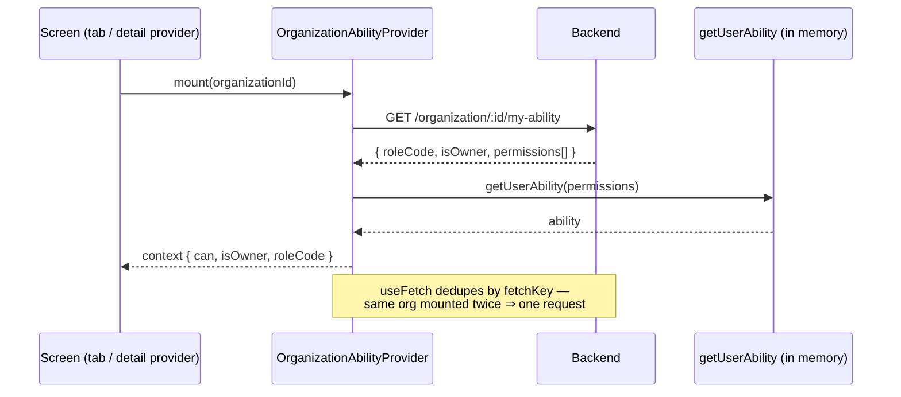
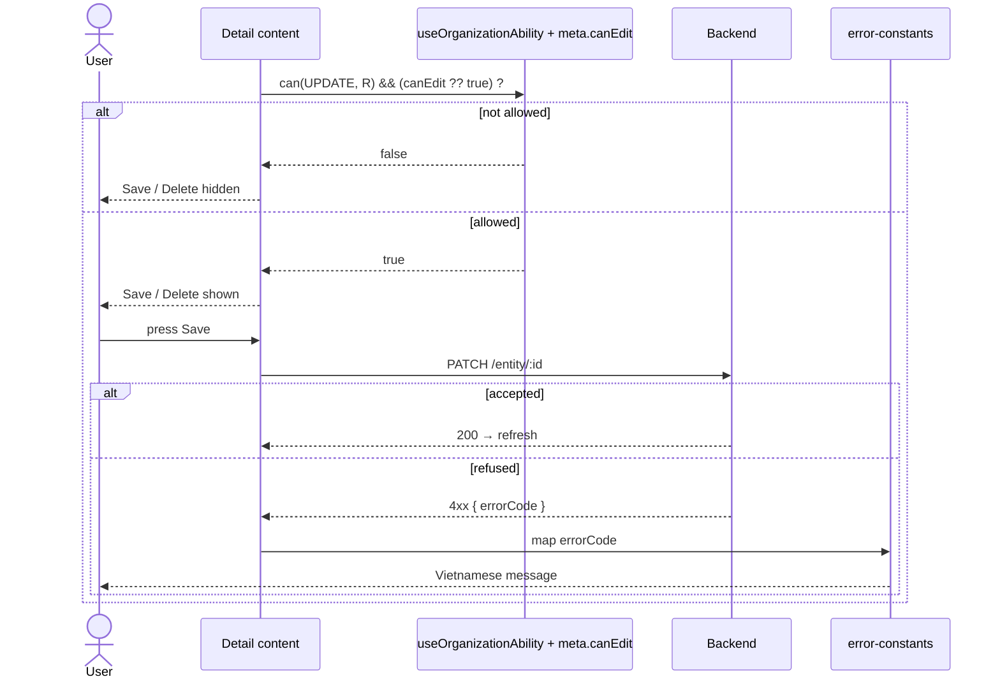

# UI Action Gating Pattern

The device hides or disables an action the current user cannot perform, so the UI never offers a
button whose request would come back refused.

## What & why

This is **UI-UX only**. It decides what to *show*, not what is *allowed*.
An action that slips past a missing or wrong gate is still refused by the server, and the device
only turns that refusal into a message (see [Reactive floor](#reactive-floor)). Proactive gating is
polish on top of that floor.

Because the device cannot be trusted to enforce, it also must not *guess* how permission is decided.
It gates **only from data the response gives it**, never from any assumption about how that data was
produced. A gate is a pure function of the response contract.

## Inputs

Three independent inputs, each answering a different question, each read from its own source. The
device never derives one from another.

| Input | Question it answers | Where it comes from |
| ----- | ------------------- | ------------------- |
| **Organization ability** | Does my role in this org allow `(action, resource)`? | `GET /organization/:id/my-ability` |
| **Record editability** | May *this specific record* be changed right now? | `meta.canEdit` on the entity response (when present) |
| **Tour participation** | Am I assigned to this tour's execution? | `useTourImplementationContext()` |

**Organization ability** — the response is:

```jsonc
// GET /organization/:id/my-ability
{
  "roleCode": "OWNER",
  "isOwner": true,
  "permissions": [{ "action": "UPDATE", "resource": "BOOKING" }, /* … */]
}
```

The device feeds `permissions` into `getUserAbility()` from `@vinaup-platform/permission` and asks
`can(action, resource)` in memory.

**Record editability** — some entity responses include `meta.canEdit: boolean`. When present it
states whether *that record* may be modified right now, regardless of the caller's role; when absent,
there is no record-level lock. The device treats it as an opaque boolean — it does not know or care
why the server set it.

**Tour participation** — tour-execution screens (crew management, tour receipt payments) gate on the
tour context, not on org ability.

## In this codebase

### The ability provider

`OrganizationAbilityProvider({ organizationId })` fetches `/my-ability`, builds the ability, and
exposes `useOrganizationAbility() → { can, isOwner, roleCode }`. It follows the
[Provider Pattern](PROVIDER-PATTERN.md); `useFetch` **dedupes by `fetchKey`**, so mounting it more
than once for the same org issues a single request.



### Where it mounts — two disjoint scopes

The provider is mounted in **two** places that cover **non-overlapping** sets of screens. Neither can
serve the other's screens, so both are required.

- **Org layout** — [`organization/[organizationId]/_layout.tsx`](../../src/app/(protected)/organization/%5BorganizationId%5D/_layout.tsx),
  keyed by the route param. Covers everything under the org tabs: the tab screens and the **create
  bars** in the home header.
- **Each org detail provider** (booking, invoice, car, trip, project) — wraps `children`, keyed by
  the loaded entity's `organizationId`. Covers the **edit/delete gates** in the detail screens.

Detail screens are sibling routes **outside** the org layout (`booking-detail/[bookingId]`,
`car-detail/[carId]`, …), so the layout mount never reaches them. The provider is not hoisted to a
shared ancestor because a detail route's `organizationId` is **not a route param** — it is known only
after the entity is fetched, inside the provider. Mounting it there, keyed by `entity.organizationId`,
is therefore its natural home.

### Gating rules

- **Create** → hide the affordance when `!can(CREATE, RESOURCE)`. (Booking/project/tour hide the whole
  create bar; invoice/car hide only the button and keep the rest of the header.)
- **Update / Delete** → AND the permission with the record's editability flag **when the response
  carries one**:

  ```ts
  onSave: canEdit && can(PERMISSION_ACTION.UPDATE, PERMISSION_RESOURCE.BOOKING) ? save : undefined
  ```

  `canEdit` and `can(...)` come from separate inputs and are combined **only at this decision point**;
  neither stands in for the other. Today only the **booking** detail response carries an editability
  flag, so only booking ANDs it; invoice/project/car/trip have no record-level lock and gate on
  permission alone. Where a response later starts carrying `meta.canEdit`, honour it the same way.
- **Tour execution** → gate on `useTourImplementationContext()`, not `useOrganizationAbility()`.



### Reactive floor

If a gate is missing or wrong, the request still goes out and comes back refused with an error code;
the device maps that code to a Vietnamese message in
[`error-constants`](../../src/constants/error-constants.ts). This is the layer that actually keeps the
UI honest — gating just spares the user an action that was going to fail anyway.

## Vocabulary

Every `action` / `resource` value is a constant from `PERMISSION_ACTION` / `PERMISSION_RESOURCE` in
`@vinaup-platform/permission` ([§1.3](../CODING-CONVENTION.md)) — never a string literal at a call
site. Resources in use: `BOOKING` `INVOICE` `PROJECT` `TOUR` `CAR` `TRIP`; directory
`ORGANIZATION_MEMBER` `ORGANIZATION_CUSTOMER` `ORGANIZATION_ROLE`; `PROJECT_CATEGORY`
`RECEIPT_PAYMENT_CATEGORY` `RECEIPT_PAYMENT` `SOCIAL_LINK`.
