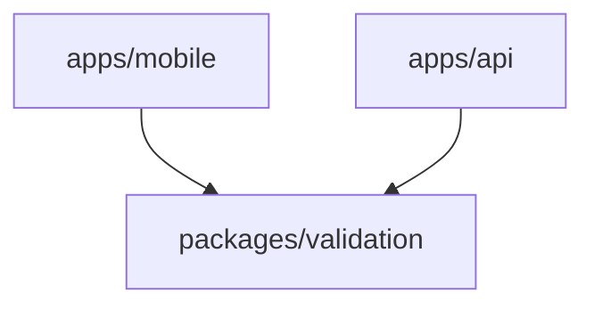

# Monorepo Component Structure

This document describes the workspace project layout and folder structure for the **VinaUp Platform** monorepo.

---

## 1. Package Dependencies

The following diagram maps how each workspace package is structurally related and depends on each other within the monorepo workspace.



---

## 2. Directory Tree Structure

A baseline skeleton of the monorepo workspace aligned to the selected technology stack and each app's coding convention. Domain folders are intentionally shown as `<domain>/` placeholders — the full domain list lives in each app's own docs.

```text
vinaup.com-platform/
├── apps/
│   ├── api/                   # Nest.js Core API Server
│   │   ├── src/
│   │   │   ├── main.ts
│   │   │   ├── app.module.ts
│   │   │   ├── _core/         # Cross-cutting request machinery: guards · filters · decorators · configs
│   │   │   ├── _common/       # Shared kernel: constants · exceptions · dtos · interfaces · utils
│   │   │   ├── prisma/        # schema.prisma · migrations · seed · generated client · PrismaModule
│   │   │   └── <domain>/      # One folder per business domain (controller · service · dtos)
│   │   ├── Dockerfile         # Multi-stage API image (build context = monorepo root)
│   │   ├── docker-compose.yml # API (app) + private PostgreSQL (db) stack
│   │   ├── package.json
│   │   ├── tsconfig.json
│   │   └── tsconfig.build.json
│   └── mobile/                # React Native Client (Expo)
│       ├── src/
│       │   ├── app/           # Expo Router file-based screens & layouts
│       │   ├── components/    # Reusable UI components
│       │   ├── providers/     # Server-state Context providers
│       │   ├── hooks/         # Zustand stores + UI hooks
│       │   ├── apis/          # Repository functions, one folder per domain
│       │   ├── interfaces/    # Response types (request types come from packages/validation)
│       │   ├── constants/     # Enums, formats, colours, storage keys
│       │   └── utils/         # Pure helpers, split by concern
│       ├── package.json
│       └── tsconfig.json
├── packages/
│   └── validation/            # Shared Zod schemas & inferred types
│       ├── src/
│       │   ├── index.ts       # Barrel: z.config(z.locales.vi()) + master exports
│       │   ├── zod-schemas/   # Shared Zod validation schemas
│       │   ├── interfaces/    # TypeScript types inferred from Zod schemas (z.infer)
│       │   └── constants/     # Enums & regex constants referenced by schemas
│       ├── package.json
│       └── tsconfig.json      # Self-contained config (no shared preset package)
├── package.json               # Root npm workspace definitions
└── package-lock.json
```
